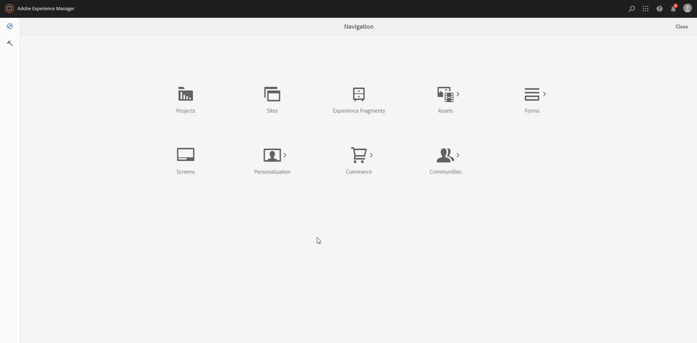
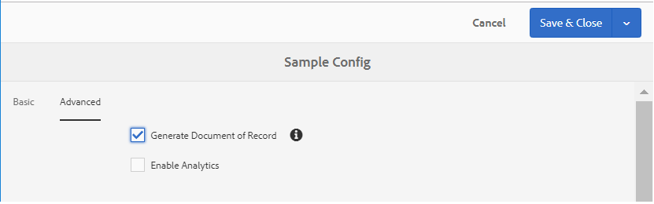

# Generate Document of Record during or after conversion {#generate-document-of-record-during-conversion}

The [Document of Record](https://helpx.adobe.com/experience-manager/6-5/forms/using/generate-document-of-record-for-non-xfa-based-adaptive-forms.html) enables you to keep a record of the information that you provide in an adaptive form so that you can refer to it later. The Automated Forms Conversion service converts non-interactive PDF forms, Acro Forms, or XFA-based PDF forms to adaptive forms. You can easily configure generating a Document of Record for the adaptive forms that you generate using the Automated Forms Conversion service.

The configuration steps to generate a Document of Record can vary based on the input PDF form. This article describes the recommended paths to generate a Document of Record based on the input PDF form.

<table border="1" cellpadding="1" cellspacing="0" width="100%"> 
 <tbody> 
  <tr> 
   <td width="30%" style="font-weight:bold">Input Form</td> 
   <td style="font-weight:bold">Methods to generate Document of Record</td> 
  </tr> 
  <tr> 
   <td>Non-interactive PDF forms</td> 
   <td><ul><li><a href="#generate-document-of-record-using-cloud-configuration">Generate Document of Record using Automated Forms Conversion service cloud configuration</a></li>
   <li><a href="#edit-adptive-form-properties-generate-document-of-record">Edit adaptive form properties after conversion to generate Document of Record</a></li></ul>
   </td> 
  </tr> 
  <tr> 
   <td>Acro Forms or XFA-based PDF forms</td> 
   <td><ul><li><a href="#use-input-form-as-template-to-generate-document-of-record">Use input form as template to generate Document of Record using Automated Forms Conversion service cloud configuration</a></li>
   <li><a href="#edit-adaptive-form-properties-to-generate-document-of-record">Edit adaptive form properties after conversion to generate Document of Record using default or any other template</a></li></ul></td> 
  </tr>   
 </tbody> 
</table>

The following image illustrates the steps required to generate a Document of record using Automated Forms Conversion service cloud configuration:

If you do not generate a Document of Record using Automated Forms Conversion service cloud configuration, you can still edit adaptive form properties after conversion to generate Document of Record.

## Generate Document of Record for Non-interactive PDF forms {#generate-document-of-record-non-interactive-pdf}

If you are using a non-interactive PDF form as the input form for Automated Forms Conversion service, you can:

* either use the conversion service cloud configuration to generate the Document of Record
* or use the conversion service to convert the non-interactive PDF form to an adaptive form and then edit the adaptive form properties to generate Document of Record

### Generate Document of Record using Automated Forms Conversion service cloud configuration {#generate-document-of-record-using-cloud-configuration}

1. Select **[!UICONTROL Tools]** > **[!UICONTROL Cloud Services]** > **[!UICONTROL Automated Forms Conversion Configuration]** > Properties of cloud configuration used for conversion > **[!UICONTROL Advanced]** > **[!UICONTROL Generate Document of Record]** option.

   

1. Tap **[!UICONTROL Save & Close]** to save the settings.

1. [Run the conversion](../help/convert-existing-forms-to-adaptive-forms.md). Ensure that you use the cloud configuration edited in step 1 of these instructions.
The conversion service automatically generates the Document of Record for the converted adaptive form.

### Edit adaptive form properties to generate Document of Record {#edit-adptive-form-properties-generate-document-of-record}

If you do not generate a Document of Record using the Automated Forms Conversion service, you can convert the non-interactive PDF form into an adaptive form and then edit its properties to generate a Document of Record.

1. [Run the conversion](../help/convert-existing-forms-to-adaptive-forms.md) on the non-interactive PDF form to generate an adaptive form.

1. Select the adaptive form in the **[!UICONTROL output]** folder and tap **[!UICONTROL Properties]**.

1. In the **[!UICONTROL Form Model]** tab, expand the **[!UICONTROL Document of Record Template Configuration]** section and select **[!UICONTROL Generate Document of Record]**.

   

1. Tap **[!UICONTROL Save & Close]** to save the settings.

## Generate Document of Record for Acro Forms or XFA-based PDF forms {#generate-document-of-record-acroform-xfaform}

If you are using an Acro Form or XFA-based PDF form as the input form for Automated Forms Conversion service, you can:

* either use input form as template to generate Document of Record using Automated Forms Conversion service cloud configuration

* or use the conversion service to convert the Acro Form or XFA-based PDF form to an adaptive form and then edit the adaptive form properties to generate Document of Record using the default template

### Use input form as template to generate Document of Record {#use-input-form-as-template-to-generate-document-of-record}

1. Select **[!UICONTROL Tools]** > **[!UICONTROL Cloud Services]** > **[!UICONTROL Automated Forms Conversion Configuration]** > Properties of cloud configuration used for conversion > **[!UICONTROL Advanced]** > **[!UICONTROL Generate Document of Record]** option.

1. Tap **[!UICONTROL Save & Close]** to save the settings.

1. [Run the conversion](../help/convert-existing-forms-to-adaptive-forms.md). Ensure that you use the cloud configuration edited in step 1 of these instructions.
The conversion service automatically associates the Acro Form or XFA-based PDF form to the converted adaptive form as the Document of Record template.
You can open the adaptive form properties to view the Document of Record template in the **[!UICONTROL Document of Record Template Configuration]** section of **[!UICONTROL Form Model]** tab.

   

### Edit adaptive form properties to generate Document of Record {#edit-adaptive-form-properties-to-generate-document-of-record}

1. [Run the conversion](../help/convert-existing-forms-to-adaptive-forms.md) on the non-interactive PDF form to generate an adaptive form.

1. Select the adaptive form in the **[!UICONTROL output]** folder and tap **[!UICONTROL Properties]**.

1. In the **[!UICONTROL Form Model]** tab, expand the **[!UICONTROL Document of Record Template Configuration]** section and select **[!UICONTROL Generate Document of Record]**.
You can also select the **[!UICONTROL Associate form template as the Document of Record template]** option to generate a Document of Record using any other template.

1. Tap **[!UICONTROL Save & Close]** to save the settings.
