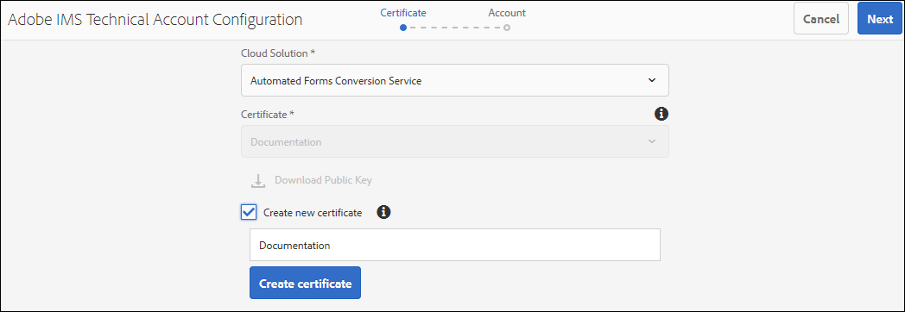
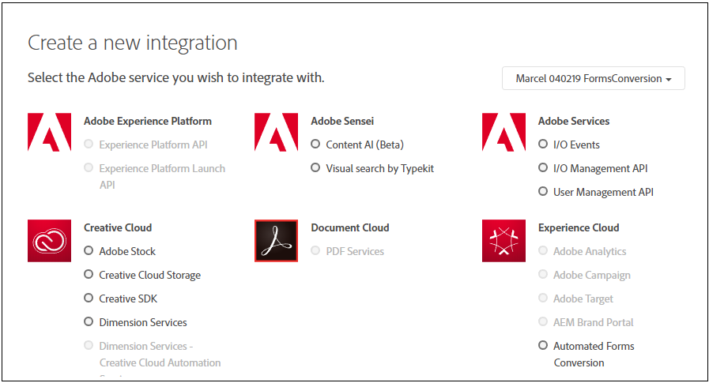
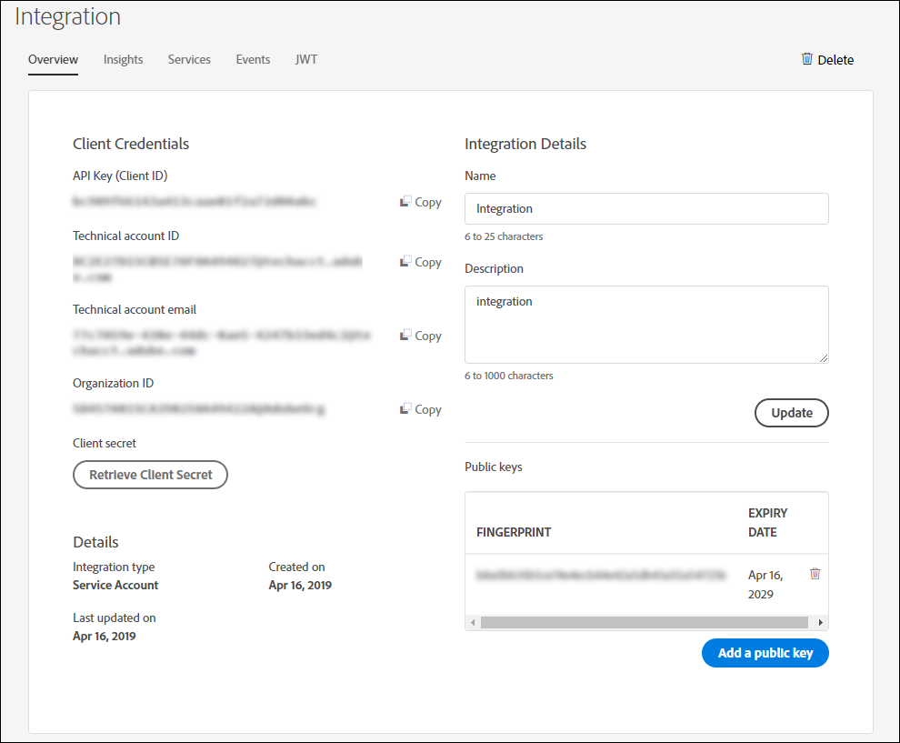
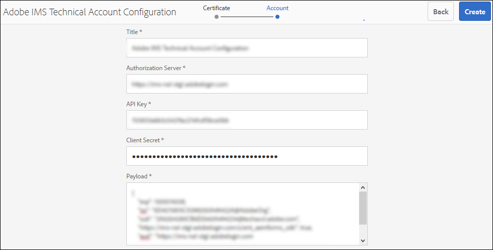
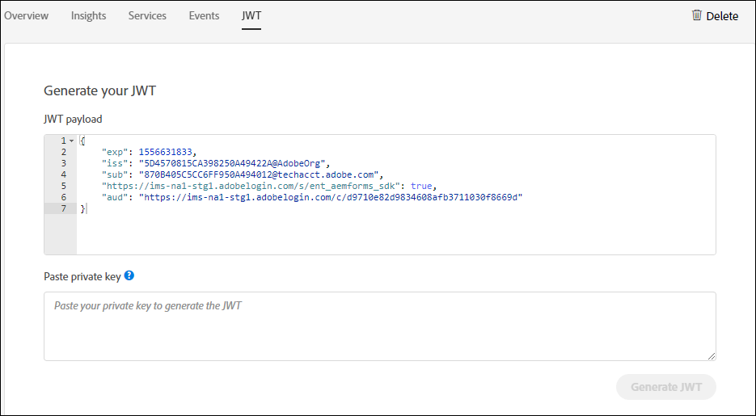

# About this help {#about-this-help}

This Help describes how an AEM administrator can configure Automated Forms Conversion service to automate conversion of their PDF forms to adaptive forms. This Help is for IT and AEM administrators at your organization.

**IT administrator:** Responsible for IT deployment planning and hardware preparation. Knowledgeable about application servers, network administration, and email server configuration.

**Product administrator: **Responsible for installing, monitoring, maintaining, and troubleshooting AEM Forms environment. AEM Forms administrator works with the IT administrator before installing the AEM software into the corporate network.

The information provided is based on the assumption that anyone reading this Help is familiar with the following technologies:

* Installing, configuring, and administering Adobe Experience Manager and AEM packages,  

* Using Linux and Microsoft® Windows operating systems,

* Configuring SMTP mail servers

>[!VIDEO](https://video.tv.adobe.com/v/27725)

*Watch the video or read the article to configure Automated Forms Conversion service*

<!--
Comment Type: draft

<h2>Introduction</h2>
-->

<!--
Comment Type: draft

<p>AEM Forms Automated Forms Conversion service, powered by Adobe Sensei, automatically converts your legacy forms to device-friendly and responsive adaptive forms. Whether you are using non-interactive PDF forms, Acro Forms, or XFA-based PDF forms, the service can easily convert these forms into adaptive forms. For information about the capabilities, conversion workflow, and onboarding information see<a href="introduction-to-automated-form-conversion-service.md"> Automated Forms Conversion</a> service.</p>
-->

## Onboarding{#onboarding}

The service is available for free to AEM 6.5 Forms On-Premise term customers and Adobe-Managed Service enterprise customers. To request access to the service for your organization, send an email to [afc-beta@adobe.com](mailto:afc-beta@adobe.com) with the following details:

* Name of your organization or business unit.
* Name, email address, and designation of an AEM administrator. [Create an Adobe ID](https://helpx.adobe.com/manage-account/using/create-update-adobe-id.html) with similar email address.
* Geographic region and country of the administrator and other users. For example, EMEA, APAC, U.S.A.

Adobe will enable access for your organization and provide required privileges to your administrator. The administrator can grant access to your AEM Forms developers (users) of your organization to connect to the service.

## Prerequisites {#prerequisites}

You require the following to use the Automated Forms Conversion Service:

* An Adobe ID account that has administrator privileges for the organization
* The Automated Forms Conversion service is enabled for your organization
* An up and running AEM 6.5 author instance with AEM 6.5 Service Pack 1 installed.  
* AEM user (developer) designated to run the service is member of forms-user group

<!--
Comment Type: draft

<p>Before you can use the Automated Forms Conversion Service, ensure the following:<br /> </p>
<ul>
<li>An up and running AEM 6.4 or later author instance</li>
<li>AEM user designated to run the service is member of forms-user group </li>
</ul>
-->

## Set up the environment {#setuptheservice}

Before using the service, prepare your AEM author instance to connect to connect to the service running on Adobe Cloud. Perform the following steps in the listed sequence to prepare your instance for the service:

1. [Download and install AEM 6.5 quickstart](#aemquickstart)
1. [Download and install AEM 6.5 Service Pack 1](#servicepack)  

1. [Download and install AEM Forms add-on package](#downloadaemformsaddon)
1. [Download and install Conversion Manager package](configure-the-automated-forms-conversion-service.md#download-and-install-the-connector-package)

>[!NOTE]
>
>If you already have an up and running Automated Forms Conversion service enviornment, to use the latest features of the conversion service, install the AEM 6.5 Service Pack 1, latest AEM Forms add-on package, and latest connector package in the aforementioned order.

<!--
Comment Type: draft

<p>Before using the service, you connect your AEM Forms instance to the service running on Adobe Cloud. Perform the following steps in the listed sequence to prepare your instance for the service and connect your AEM Forms instance to the service:</p>
<ul>
<li><a href="https://helpx.adobe.com/experience-manager/6-5/forms/using/installing-configuring-aem-forms-osgi.html" target="_blank">Download and install AEM Forms add-on package</a></li>
<li><a href="configure-the-automated-forms-conversion-service.md#download-and-install-the-connector-package" target="_blank">Download and install Conversion Manager package</a></li>
<li><a data-disable-query="false" href="#configureemailnotification">Configure email notifications and add user to the forms-users group</a></li>
<li><a href="configure-the-automated-forms-conversion-service.md#configure-the-cloud-service" target="_blank">Configure the cloud service</a></li>
</ul>
-->

### Download and install AEM 6.5 quickstart {#aemquickstart}

Automated Forms Conversion service runs on AEM 6.5 author instance. You require AEM 6.5 quickstart to set up an AEM 6.5 author instance. If you do not have AEM quickstart, download it from the following locations:

* If you are an existing AEM customer, download AEM 6.5 quickstart from [Adobe Licensing website](http://licensing.adobe.com) or from [Adobe support website](https://daycare.day.com/home/products/cq_wcm.html).

* If you are an Adobe partner, use [Adobe Partner Training Program](https://adobe.allegiancetech.com/cgi-bin/qwebcorporate.dll?idx=82357Q) to request the quickstart.

After you download the quickstart, for instructions to set up an AEM 6.5 author instance, see [deploying and maintaining](https://helpx.adobe.com/experience-manager/6-5/sites/deploying/using/deploy.html#defaultlocalinstall).

### Download and install AEM 6.5 Service Pack 1 {#servicepack}

Download and install AEM Service Pack 1 (6.5.1.0). For detailed instructions see, [AEM 6.5 Service Pack Release Notes](https://helpx.adobe.com/experience-manager/6-5/release-notes/sp-release-notes.html).

### Download and install AEM Forms add-on package  {#downloadaemformsaddon}

An AEM instance contains basic forms capabilities. The conversion service requires full capabilities of AEM Forms. Download and install AEM Forms add-on package to avail all the capabilities of AEM Forms. The package is required to set up and run the conversion service:

1. Log in to [Adobe Prerelease](https://www.adobeprerelease.com/) site. Open the **My Programs **tab. Click view program for the **AEM - Automated Forms Conversion Service Beta** program. On the AEM - Automated Forms Conversion Service Beta page, click the **Download Builds** option. From the Download Builds section, download the **AEM Forms Add-on Package**.

   <!--
   Comment Type: draft

   <p>Download the AEM 6.5 Forms add-on package from the <a href="https://helpx.adobe.com/aem-forms/kb/aem-forms-releases.html">AEM Forms Releases</a> page or from the <strong>Download Builds</strong> section on the <a href="https://www.adobeprerelease.com/" target="_blank">prerelease website</a>. The conversion service supports only Microsoft Windows and Linux operating systems. Do not download or install the add-on package for any other operating system.</p>
   -->

1. After you download the package, log in to AEM instance as an administrator and open the [Package Manager](https://helpx.adobe.com/experience-manager/6-5/sites/administering/using/package-manager.html). The default URL is [http://&lt;server&gt;:&lt;port&gt;/crx/packmgr/index.jsp](http://%3Cserver%3E:4502/crx/packmgr/index.jsp).

   >[!CAUTION]
   >
   >Use your local AEM credentials to login to AEM instance. Do not use Adobe ID to login to AEM instance.

1. Click **Upload Package**, select the AEM Forms add-on package, and click **Upload**. After the package is uploaded, click package name, and click **Install**. The package is installed.

   >[!CAUTION]
   >
   >After the package is installed, you are prompted to restart the AEM instance. **Do not immediately restart the server.** Before stopping the AEM Forms server, wait until the ServiceEvent REGISTERED and ServiceEvent UNREGISTERED messages stop appearing in the [AEM-Installation-Directory]/crx-quickstart/logs/error.log file and the log is stable.

1. Configure Boot Delegation for RSA/BouncyCastle libraries:

    1. Stop the AEM instance. Navigate to the [AEM installation directory]\crx-quickstart\conf\ folder. Open the sling.properties file for editing.

       If you use [AEM installation directory]\crx-quickstart\bin\start.bat to start an AEM instance, edit the sling.properties located at [AEM_root]\crx-quickstart\.
    1. Add the following properties to the sling.properties file:

       ```
       sling.bootdelegation.class.com.rsa.jsafe.provider.JsafeJCE=com.rsa.*
       sling.bootdelegation.class.org.bouncycastle.jce.provider.BouncyCastleProvider=org.bouncycastle.*
       ```

    1. Save and close the file.
    1. Start the AEM instance.

       <!--    
       Comment Type: draft    
    
       <li>Step text</li>    
       -->

   <!--
   Comment Type: draft

   <li>Step text</li>
   -->

### Download and install the Connector package  {#download-and-install-the-connector-package}

The connector package allows you to connect your AEM instance with conversion service running on Adobe Cloud. It also provides the ability to create cloud configurations for the service and Review and Correct editor. Perform the following steps to download and install the package:

1. Log in to [Adobe Prerelease](https://www.adobeprerelease.com/) site. Open the **My Programs **tab. Click view program for the **AEM - Automated Forms Conversion Service Beta** program. On the AEM - Automated Forms Conversion Service Beta page, click the **Download Builds** option. From the Download Builds section, download the **AEM Automated Forms Conversion Service - Connector Package**.
1. Log in to AEM instance as an administrator and open the Package Manager. The default URL is [http://&lt;server&gt;:&lt;port&gt;/crx/packmgr/index.jsp](http://%3Cserver%3E:4502/crx/packmgr/index.jsp).
1. Click **Upload Package**, select the AEM Forms Automated Forms Conversion service package, and click **Upload**. After the package is uploaded, click package name, and click **Install**. The package is installed.

   >[!NOTE]
   >
   >If you already have a previous version of the connector package installed on your AEM author instance, do not uninstall it. Keep all the previous versions of the package installed and install the new version of package on top of previous versions. Uninstalling the connector package breaks the connection between local AEM author instance and Automated Forms Conversion service. If you uninstall the connector package by mistake, install the new connector package, delete the old IMS configuration, and [re-connect your local AEM author instance to Automated Forms Conversion service](#connectafcadobeio).

1. Restart your AEM instance.

   <!--
   Comment Type: draft

   <li>Step text</li>
   -->

<!--
Comment Type: draft

<ol>
<li><p>Log in to AEM instance as an administrator and open the package share. The default URL of the package share is <a>http://[server]:[port]/crx/packageshare</a>.</p> </li>
<li><p>In package share, search <strong>AEM Forms <strong>Conversion Manager package</strong></strong>, click the package applicable to your AEM Forms instance, and click <strong>Download</strong>. Read and accept the license agreement and click <strong>OK</strong>. The download starts.</p> </li>
<li><p>After the download completes, click <strong>Downloaded</strong>. You are redirected to package manager. In the package manager, search the downloaded package, and click <strong>Install</strong>. </p> <p>After the package is successfully installed, the <strong>Start Automated Form Conversion</strong> option becomes visible in Forms & Documents UI. Do not start the conversion yet. </p> </li>
<draft-comment type="draft">
<li>Step text</li>
</draft-comment>
<draft-comment type="draft">
<li>Step text</li>
</draft-comment>
</ol>
-->

## Configure the service {#configure-the-service}

Before you proceed to configure the service and connect your local instance with the service running on Adobe Cloud, learn about the personas and privileges required to connect to the service. The service uses two different types of personas, administrators and developers:

* **Administrators**: Administrators are responsible for managing Adobe software and services for their organization. Administrators grant access to developers in their organization to connect to Automated Forms Conversion service running on Adobe Cloud. When an administrator is provisioned for an organization, the administrator receives an email with title ****[!UICONTROL 'You now have administrator rights to manage Adobe software and services for your organization']****. If you are an administrator, check your mailbox for email with aforementioned title and proceed to [grant access to developers of your organization](#adduseranddevs).

### (For administrators only) Grant access to developers of your organization {#adduseranddevs}

After Adobe enables access for your organization and provides required privileges to the administrator, the administrator can log into Admin Console (detailed instructions below), create a profile, and add developers to the profile. Developers can connect a local instance of AEM Forms to Automated Forms Conversion service on Adobe Cloud.

Developers are members of your organization designated to run the conversion service. Only those developers which are added to Adobe Automated Forms Conversion service profile are entitled to use the Automated Forms Conversion service. Perform the below steps to create a profile and add developers to it:

1. Log in to [Admin Console](https://adminconsole.adobe.com/). Click the **Automated Forms Conversion** option.

   >[!CAUTION]
   >
   >Use **Adobe ID **of administrator provisioned to use Automated Forms Conversion service to login. Do not any other ID or Federated ID to login.

   

1. Click** New Profile** in the **Products **tab.

   

1. Specify **Name**, **Display Name**, and **Description** for the profile. Click **Done**. A profile is created.

   

1. 

   Once an administrator adds developers to Adobe I/O profile, the developers are notified via email. After receiving the email, the developers can proceed to [connect a local AEM Forms instance with Automated Forms Conversion service on Adobe Cloud](#connectafcadobeio).

### (For developers only) Connect your local AEM Forms instance to Automated Forms Conversion service on Adobe Cloud {#connectafcadobeio}

After an administrator provides you developer access, you can connect your local AEM Forms instance to Automated Forms conversion service running on Adobe Cloud. Perform the following steps in the listed sequence to connect your AEM Forms instance to the service:

* [Configure email notifications and add user to the forms-users group](configure-the-automated-forms-conversion-service.md#configureemailnotification)
* [Obtain public certificates](#obtainpubliccertificates)
* [Create Adobe I/O integration](#createintegration)
* [Configure the cloud service](configure-the-automated-forms-conversion-service.md#configure-the-cloud-service)

#### Configure email notification and add user to the forms-users group {#configureemailnotification}

Configure the ****[!UICONTROL Day CQ Mail Service]**.** Automated Forms conversion service uses the Day CQ mail service to send email notifications. These email notifications contain information about successful or failed conversions. If you choose not receive notification, skip to configure the Day CQ Mail Service.

Perform the following steps to configure the Day CQ Mail Service:

<!--
Comment Type: annotation
Last Modified By: khsingh
Last Modified Date: 2018-12-17T02:00:03.194-0500
Day CQ Mail Service: - After beta, change the email link to /content/help/en/experience-manager/6-5/sites/administering/using/notification.html#ConfiguringtheMailService form users - After beta, change the email link to /content/help/en/experience-manager/6-5/forms/using/forms-groups-privileges-tasks.html
-->

1. Go to AEM configuration manager at `http://localhost:4502/system/console/configMgr`
1. Open the Day CQ Mail Service configuration. Specify a value for the ****[!UICONTROL SMTP server host name]****, ****[!UICONTROL SMTP server port]**,** and ****[!UICONTROL From address]** **fields. Click ****[!UICONTROL Save]****.

   You can contact email service provider or IT administrator for information about host name and port of SMTP server. You can use any valid email address in from field. For example, notification@example.com or donotreply@example.com

1. Open the ****[!UICONTROL Day CQ Link Externalizer]**** configuration. In the ****[!UICONTROL Domains]****field, specify the actual host name or IP address and port number for local, author, and publish instances. Click ****[!UICONTROL Save]****.

Specify an email address in the profile of the AEM user designated to run the service. Ensure that the user is the member of the [forms user](https://helpx.adobe.com/experience-manager/6-4/forms/using/forms-groups-privileges-tasks.html) group. Emails are sent to the email address of user running the conversion. To specify an email address for the user and add user to the forms user group:

1. Log in to your AEM Forms author instance as an AEM administrator. Tap **[!UICONTROL Adobe Experience Manager]** > **[!UICONTROL Tools]**> **[!UICONTROL Security]** > **[!UICONTROL Users]**.

   >[!NOTE]
   >
   >Use your local AEM credentials to login. Do not use Adobe ID to login.

1. Select a user designated to run the conversion service and tap **[!UICONTROL Properties]**. The Edit User Settings page opens.
1. Specify an email address in the **[!UICONTROL Email]**field and Tap **[!UICONTROL Save]**. The emails are sent to specified email address on successful completion or failure of the conversion.
1. Tap the **Groups** tab. In the select group tab, type and select the **forms-users** group. Tap **Save & Close**. The user is now a member of the forms-users group.

   <!--
   Comment Type: draft

   <li>Step text</li>
   -->

#### Obtain public certificates {#obtainpubliccertificates}

A public certificate allows you to authenticate your profile on Adobe I/O.

1. Log in to your AEM Forms author instance. Navigate to **[!UICONTROL **Tools **> **Security** > **Adobe IMS Configurations**]****. **Tap ****[!UICONTROL Create]**. **The ****[!UICONTROL Adobe IMS Technical Account Configuration]**** page appears.

   

1. Select **[!UICONTROL **Automated Forms Conversion Service**]**in Cloud Solution.  

1. Select the ****[!UICONTROL Create new certificate]**** check box and specify an alias. The alias serves as name of the dialog.

   Tap ****[!UICONTROL Create certificate]****. A dialog appears. Click ****[!UICONTROL OK]****. The certificate is created.

1. Tap ****[!UICONTROL Download Public Key]** **and save the *AEM-Adobe-IMS.crt* certificate file on your machine. The certificate file is used to [create integration on Adobe I/O Console](#createintegration). Tap ****[!UICONTROL Next]****.  

1. Specify the below:

    * Title: Specify a title.  
    * Authorization Server: [https://ims-na1.adobelogin.com](https://ims-na1.adobelogin.com)

   Leave the other fields blank for now (to be provided later). Keep the page open.

   <!--
   Comment Type: draft

   <li> </li>
   -->

   <!--
   Comment Type: draft

   <li>Step text</li>
   -->

#### Create Adobe I/O integration {#createintegration}

To use Automated Forms Conversion service, create an integration in Adobe I/O. The integration generates API Key, Client Secret, Payload (JWT).

1. Log in to [https://console.adobe.io/](https://console.adobe.io/). Use your Adobe ID to login.

   >[!CAUTION]
   >
   >Use your developer account that your administrator has provisioned to login to Adobe I/O console.

1. Tap **[!UICONTROL **View** **Integrations**]**. A screen with all the available integrations appears.
1. Select your organization from the drop-down under ****[!UICONTROL Integrations]****. Tap ****[!UICONTROL New Integration]****, select ****[!UICONTROL Access an API]****, and tap ****[!UICONTROL Continue]****.
1. Select **[!UICONTROL **Experience Cloud** > **Automated Forms Conversion**]** and tap ****[!UICONTROL Continue]****. If the Automated Forms Conversion option is disabled for you, ensure that you have selected correct organization from the drop-down box above the **[!UICONTROL Adobe Services]** option. If you do not know your organization, contact your administrator.

   

1. Specify name and description for the integration. Tap **Select a File from your computer** and upload the AEM-Adobe-IMS.crt file downloaded in the [Obtain Public Certificates](#obtainpubliccertificates) section.
1. Select the profile created while [granting access to developers of your organization](#adduseranddevs) and tap **Create Integration**. The integration is created.
1. Tap **Continue to integration** **details** to view the integration information. The page contains API Key, Client Secret, and other information required to connect your local AEM instance to Automated Forms Conversion service. The information on the page is used to create IMS configuration on your local machine.

   

1. Open the IMS Configuration page on your local instance. You kept the page open at the end of section, [Obtain public certificate](#obtainpubliccertificates).

   

1. On the Adobe IMS Technical page, specify API Key and Client Secret. Use the values specified on the integration page.

   **For payload, use the code provided in the JWT tab of the integration page. **Tap Save. The IMS configuration is created. Close the integration page.

   

   >[!CAUTION]
   >
   >Create only one IMS configuration. Do not create more than one IMS configurations.

1. Select the IMS configuration and tap **Check Health**. A dialog box appears. Tap **Check. **On successful connection, the *Token retrieved successfully* message appears.

   

   <!--
   Comment Type: draft

   <note type="note">
   <p>If you do not see the options bar, open the Adobe IMS Configuration page in Microsoft Internet Explorer and check health.<br /> </p>
   </note>
   -->

#### Configure the cloud service {#configure-the-cloud-service}

Create a cloud service configuration to connect your AEM instance to the conversion service. It also allows you to specify a template, theme, and form fragments for a conversion. You can create multiple cloud service configurations separate for each set of forms. For example, you can have a separate configuration for sales department forms and a separate one for customer support forms. Perform the following steps to create a cloud service configuration:

1. On your AEM Forms instance, tap **[!UICONTROL Adobe Experience Manager]** > **[!UICONTROL Tools]**> **[!UICONTROL Cloud Services]** > **[!UICONTROL Automate Forms Conversion Configuration]**.
1. Tap the **[!UICONTROL **Global**]**folder and tap ****[!UICONTROL Create]****. The page to create Automated Forms Conversion configuration appears. The configuration is created in the Global folder. You can also create the configuration in a different folder that already exists or create a new folder for your configurations.

1. On the **[!UICONTROL Create Automated Forms Conversion Configuration]** page, specify value for the following fields and tap **Next**.

|Field|Description|
|--- |--- |
|Title|Unique title for the configuration. The title is displayed in the UI used to start conversion.|
|Name|Unique name for the configuration. The configuration is saved in the CRX-Repository with the specified name. The name can be identical to the title.|
|Thumbnail location|Location of the thumbnail for the configuration.|
|Service URL|URL of the Automated Forms Conversion service on Adobe Cloud. Use the `https://aemformsconversion.adobe.io/` URL.|
|Template|Default template to be applied to converted forms. You can always specify a different template before starting the conversion. A template contains basic structure and initial content for an adaptive form. You can choose a template from the templates provided out-of-the-box. You can also create a custom template.|
|Theme|Default theme to be applied to converted forms. You can always specify a different theme before starting the conversion.  You can click the icon to choose a theme provided out-of the box. You can also create a custom theme.|
|Existing Fragments|Location of existing fragments, if any.|
|Custom Meta-model|Path of the .schema.json file of custom meta-model.|

   

1. In the **[!UICONTROL Advanced]**tab of the **[!UICONTROL Create Automated Forms Conversion Configuration]** page, specify value for the following field:

|Field|Description|
|--- |--- |
|Generate Document of Record|Select the option to automatically generate Document of Record for converted forms. The option is only for XFA-based forms (XDP and PDF Forms). When you enable the option, after submitting a form, you can allow your customers to keep a record, in print or in document format, of the information they have filled in the form for their future reference. This is referred to as a document of record.|
|Enable Analytics|Select the option to enable Adobe Analytics on all the converted forms. Before using the option, ensure Adobe Analytics is enabled for your AEM Forms instance.|

    * When the source is an XFA-based form with extension .XDP, then the output DOR retains the XFA layout, else the conversion service uses an out-of-the-box template to generate DOR for other XFA-based forms.
    * When an XFA form is submitted, submit data of the form is saved as an XML element or an attribute. For example, &lt;Amount currency="USD"&gt;10.00&lt;/Amount&gt;. The currency is saved as an attribute and currency amount, 10.00 is saved as an element. Submit data of an adaptive form does not have attributes, it has only elements. So, when an XFA-based form is converted to adaptive form, the adaptive form submit data contains an element for each such attribute. For example,

```css
   {

                  "Type": "Principal",

                  "Amount": "10.00",

                  "currency": "USD"

     }
```

1. Tap** Create**. The cloud configuration is created. Your AEM Forms instance is ready to start converting legacy forms to adaptive forms.

## Previous {#previous}

* [Introduction to Automated Forms Conversion service](introduction-to-automated-form-conversion-service.md)

## Next {#next}

* [Use Automated Forms Conversion service](convert-existing-forms-to-adaptive-forms.md)
