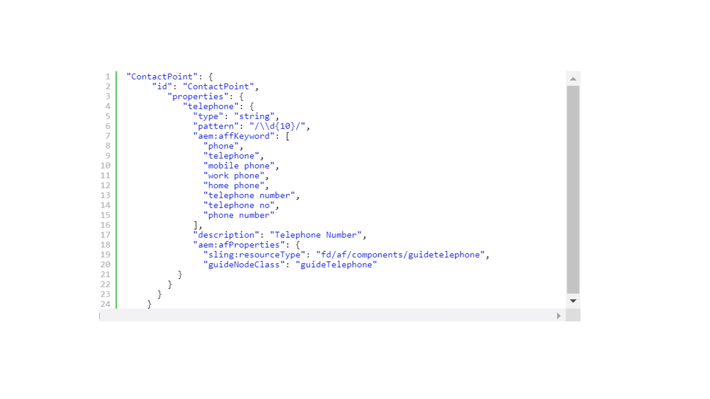

# Extend the default meta-model {#extend-the-default-meta-model}

Automated Forms Conversion service identifies and extracts form objects from source forms. Semantic mapper helps the service to decide how the extracted objects are represented in an adaptive form. For example, a source form can have many different types of representations of a date. The semantic mapper helps map all the representations of date form objects of the source form with date component of the adaptive forms. Semantic mapper also allows the service to pre-configure and apply validations, rules, data patterns, Help text, and accessibility properties to adaptive form components during conversion.


Meta-model is a JSON schema. Before you start with meta-model, ensure that you are well versed with JSON. You must have experience in creating, editing, and reading data saved in JSON format.

## Default meta-model {#default-meta-model}

Automated Forms Conversion service has a default meta-model. It is a JSON schema and resides on Adobe Cloud with other components of Automated Forms Conversion service. You can find a copy of the meta-model on your local AEM server at: http://&lt;server&gt;:&lt;port&gt;/aem/forms.html/content/dam/formsanddocuments/metamodel/`global.schema.json`. You can also [click here](assets/en.globalschema.json) to access or download the English language schema. The meta-model for [French](assets/fr.globalschema.json), [German](assets/de.globalschema.json), and [Spanish](assets/es.globalschema.json) languages are also available for download.

The schema of meta-model is derived from schema entities at https://schema.org/docs/schemas.html. It has Person, PostalAddress, LocalBusiness, and more entities as defined on https://schema.org. Every entity of the meta-model adheres to the JSON schema object type. The following code represents a sample meta-model structure:

```
   "Entity": {
      "id": "Entity",
      "properties": {
        "name": {
          "type": "string"
        },

        "description": {
          "type": "string",
          "description": "Description of the item"
        }
      }
    }
```

## Download the default meta-model {#download-the-default-meta-model}

Perform the following steps to download the default meta-model to the local file system:

1. Log in to your AEM Forms instance. 
1. Navigate to the **[!UICONTROL Forms]** > **[!UICONTROL Forms & Documents]** **>** **[!UICONTROL Meta Model]** folder.
1. Select the **[!UICONTROL global.schema.json]** file and tap **[!UICONTROL Download]**. A download dialog box appears. Select the **[!UICONTROL Download asset(s) as binary files]** option. Tap **[!UICONTROL Download]**. An archive is downloaded.

   <!--
   Comment Type: draft

   <li><p>Extract the archive and open the global.schema.json file for editing. </p> </li>
   -->

   <!--
   Comment Type: draft

   <li>Step text</li>
   -->

## Understanding the meta-model {#understanding-the-meta-model}

A meta-model refers to a JSON schema file that contains entities. All entities in the JSON schema file include a name and an id. Each entity can include multiple properties. The entities and its properties can vary based on the domain. You can augment a schema file with keywords and field configurations to map schema properties to adaptive form components.

```
"Event": {
      "id": "Eventid",
      "allOf": [
        {
          "$ref": "#Entity"
        },
        {
          "properties": {
            "startDate": {
              "type": "string",
              "format": "date",
              "description": "Specify the start date and time of the event in ISO 8601 date format."
            },
            "endDate": {
              "type": "string",
              "format": "date",
              "description": "Specify the end date and time of the event in ISO 8601 date format."
            },
            "location": {
              "$ref": "#PostalAddress",
              "description": "Specify the location of the event."
            }
          }
        }
      ]
    }
```

In this example, **Event** represents the name of an entity with a value for **id** as **Eventid**. The Event entity includes multiple properties:

* startDate
* endDate
* location

The **allOf** construct in the meta-model enables inheritance among entities.

Each property can further include:

* [JSON schema properties](#jsonschemaproperties)
* [Keyword-based search to apply properties to generated adaptive form fields](#keywordsearch)
* [Additional properties](#additionalproperties)



Based on the keywords referenced using **aem:affKeyword**, the conversion service performs a search operation on the source form fields. The conversion service applies the JSON schema properties and additional properties to the fields that meet the search criteria.

In this example, the conversion service searches for the phone, telephone, mobile phone, work phone, home phone, telephone number, telephone no, and phone number keywords in the source form. Based on the fields that include these keywords, the conversion service applies the type, pattern, and aem:afProperties to the adaptive form fields after conversion.

### JSON schema properties for generated adaptive form fields {#jsonschemaproperties}

The meta-model supports the following JSON schema common properties for adaptive form fields generated using the Automated Forms Conversion service:

<table> 
 <tbody> 
  <tr> 
   <th><strong>Property Name</strong></th> 
   <th><strong>Description</strong></th> 
  </tr> 
  <tr> 
   <td><p>title</p></td> 
   <td> 
    <p>The text mentioned within the title property in a meta-model serves as a search keyword to perform actions on the generated adaptive form fields. For example, modifying the label of an adaptive form field. For more information, see <strong>Modify the label of a form field</strong> in <a href="#custommetamodelexamples">Custom meta-model examples.</a></p> </td> 
  </tr>
  <td><p>description</p></td> 
   <td> 
    <p>The description property sets the Help text for the generated adaptive form field. For more information, see <strong>Add Help text to a form field</strong> in <a href="#custommetamodelexamples">Custom meta-model examples.</a></p> </td> 
  </tr>
  <td><p>type</p></td> 
   <td> 
    <p>The type property defines the data type for the generated adaptive form field. The possible values for the title property include:</p>
    <ul> 
     <li>string: Generates an adaptive form field of text data type.</li> 
     <li>number: Generates an adaptive form field of numeric data type.</li>
     <li>integer: Generates an adaptive form field of numeric data type with sub-type set to integer.</li>
     <li>boolean: Generates a switch adaptive form component.</li>
     </ul><p>For more information on using the type property in a meta-model, see <strong>Modify the type of a form field</strong> in <a href="#custommetamodelexamples">Custom meta-model examples.</a></p></td> 
  </tr>
  <td><p>pattern</p></td> 
   <td> 
    <p>The pattern property restricts the value for the generated adaptive form field based on a regular expression. For example, the following code in the meta-model restricts the value for the generated adaptive form field to ten digits:<br>"pattern": "/\\d{10}/"<br>Similarly, the following code in the meta-model restricts the value of a field to a specific date format.<br> "pattern": "date{DD MMMM, YYYY}",</p> </td> 
  </tr>
  <td><p>format</p></td> 
   <td> 
    <p>The format property restricts the value for the generated adaptive form field based on a named pattern instead of a regular expression. The possible values for the format property include:<ul><li>email: Generates an email adaptive form component.</li><li>hostname: Generates a textbox adaptive form component.</li></ul>For more information on using the format property in a meta-model, see <strong>Modify the format of a form field</strong> in <a href="#custommetamodelexamples">Custom meta-model examples.</a></p> </td> 
  </tr>
  <td><p>enum and enumNames</p></td> 
   <td> 
    <p>The enum and enumNames properties restrict the values of drop-down, check box, or radio button fields to a fixed set. Values listed in enumNames are displayed on the user interface. The values listed using the enum property are used for calculation.<br>For more information, see <strong>Convert a form field to multiple-choice check boxes in the adaptive form</strong>, <strong>Convert a text field to drop-down list in the adaptive form</strong>, and <strong>Add additional options to the drop-down list</strong> in <a href="#custommetamodelexamples">Custom meta-model examples.</a></p> </td> 
  </tr>
 </tbody> 
</table>

### Keyword-based search to apply properties to generated adaptive form fields {#keywordsearch}

Automated Forms Conversion service performs a keyword search on the source form during conversion. After filtering the fields that meet the search criteria, the conversion service applies the properties defined for those fields in the meta-model to the generated adaptive form fields.

Keywords are referenced using the **aem:affKeyword** property.

```
{
  "numberfields": {
      "type": "number",
      "aem:affKeyword": ["Bank account number"]
 }
}
```

In this example, the conversion service uses the text within **aem:affKeyword** as a search keyword. After retrieving the **Bank account number** text in the form, the conversion service converts the field into a **number** type using the **type** property.

### Additional properties for generated adaptive form fields {#additionalproperties}

You can use the **aem:afProperties** property in the meta-model to define following additional properties for adaptive forms fields generated using Automated Forms Conversion service:

<table> 
 <tbody> 
  <tr> 
   <th><strong>Property Name</strong></th> 
   <th><strong>Description</strong></th> 
  </tr> 
  <tr> 
   <td><p>multiLine</p></td> 
   <td> 
    <p>The multiLine property converts a source form field into a multi-line field in the adaptive form after conversion. For more information, see <strong>Convert a string field to a multi-line field</strong> in <a href="#custommetamodelexamples">Custom meta-model examples.</a></p> </td> 
  </tr>
  <td><p>mandatory</p></td> 
   <td> 
    <p>The mandatory property sets the input for an adaptive form field after conversion as mandatory.<br>For more information, see <strong>Add validations to adaptive form fields</strong> in <a href="#custommetamodelexamples">Custom meta-model examples.</a></p>
    </td> 
  </tr>
  <td><p>jcr:title</p></td> 
   <td> 
    <p>The jcr:title property, with the title JSON schema property, enables you to modify the label of an adaptive form field after conversion.<br>For more information, see <strong>Modify the label of a form field</strong> in <a href="#custommetamodelexamples">Custom meta-model examples.</a><br>See <a href="https://helpx.adobe.com/experience-manager/6-5/forms/using/adaptive-form-json-schema-form-model.html" target="_blank">Creating adaptive forms using JSON schema</a> for information on more properties that you can apply to adaptive form fields using JSON schema.</p>
    <p></p></td> 
  </tr>
  <td><p>sling:resourceType and guideNodeClass</p></td> 
   <td> 
    <p>sling:resourceType and guideNodeClass properties enable you to map a form field to a corresponding adaptive form component.<br>For more information, see <strong>Convert a form field to multiple-choice check boxes in the adaptive form</strong> and <strong>Convert a text field to drop-down list in the adaptive form</strong> in <a href="#custommetamodelexamples">Custom meta-model examples.</a></p> </td> 
  </tr>
  <td><p>validatePictureClause</p></td> 
   <td> 
    <p>The validatePictureClause property sets a validation on the format allowed in the adaptive form field after conversion.<br>For more information, see <strong>Add validations to adaptive form fields</strong> in <a href="#custommetamodelexamples">Custom meta-model examples.</p> </td> 
  </tr>
 </tbody> 
</table>

## Create a custom metamodel in your own language{#language-specific-meta-model}

You can create a language specific meta-model. Such meta-model helps you create mapping rules in language of your choice. Automated Forms Conversion service allows you to create meta-models in the following languages:

* English(en)
* French(fr) 
* German(de)
* Spanish(es)

Add the *aem:Language* metatag tag to the top a meta-model to specify its language. For example,  

```JSON
"metaTags": {
        "aem:Language": "fr"
    }
```

When no language is specified, the service considers that the meta-model is in English language. 

### Considerations for Creating a language specific meta-model

* Ensure name of every key is in English language. For example, emailAddress.
* Ensure all the entity references and pre-defined values of all the id key comprise only ASCII characters. For example "id": "ContactPoint" / "$ref": "#ContactPoint". 
* Ensure all the values corresponding to the following keys are in the specified meta-model language:
  * aem:affKeyword
  * title
  * description
  * enumNames
  * shortDescription
  * validatePictureClauseMessage
  
  For example, when the language of meta-model is French ("aem:Language": "fr"), ensure that all the descriptions and messages are in French language.

* Ensure all [JSON schema properties](#jsonschemaproperties) use only supported values. For example, the type property can only span selected values of String, Number, Integer, and Boolean.

The following image displays examples of English language meta-model and corresponding French Language meta-model:


## Modify adaptive form fields using custom meta-model {#modify-adaptive-form-fields-using-custom-meta-model}

Your organization can have patterns and validations in addition to the ones listed in the default meta-model. You can extend the default meta-model to add pattern, validations, and entities specific to your organization. Automated Forms Conversion service applies the custom meta-model to the form fields during conversion. You can keep updating the meta-model as new patterns, validations, and entities specific to your organization are discovered.

Automated Forms Conversion service uses a default meta-model saved at the following location to map source form fields to the adaptive form fields during conversion:

http://&lt;server&gt;:&lt;port&gt;/aem/forms.html/content/dam/formsanddocuments/metamodel/global.schema.json

However, you can save a custom meta-model in a folder and modify the conversion service properties to use the custom meta-model during conversion.

### Use custom meta-model during conversion {#use-custom-meta-model-during-conversion}

Execute the following steps to use a custom meta-model during conversion:

1. Create a folder in **[!UICONTROL Forms]** > **[!UICONTROL Forms & Documents]** and upload the custom meta-model JSON schema file to the folder.
1. Open the conversion service properties using:

   **[!UICONTROL Tools]** > **[!UICONTROL Cloud Services]** > **[!UICONTROL Automated Forms Conversion Configuration]**&gt; **&lt;**Properties of selected configuration**&gt;**

1. In the **[!UICONTROL Basic]** tab, specify the location of the custom meta-model in the **[!UICONTROL Custom Meta-model]** field and tap **[!UICONTROL Save & Close]**.
1. [Run the conversion](convert-existing-forms-to-adaptive-forms.md#start-the-conversion-process) to apply the custom meta-model to the conversion process.

### Custom meta-model examples {#custommetamodelexamples}

Some common examples of using a custom meta-model to modify adaptive form field properties include:

* Modify the label of a form field
* Modify the type of a form field
* Add Help text to a form field
* Convert a form field to multiple-choice radio buttons in the adaptive form
* Modify the format of a form field
* Add validations to adaptive form fields
* Convert a form field to drop-down list options in the adaptive form
* Add additional options to the drop-down list
* Convert a string field to a multi-line field

#### Modify the label of a form field {#modify-the-label-of-a-form-field}

**Example:** Modify the Bank account number label in the form to Custom account Number in the adaptive form after conversion.

In this custom meta-model, the conversion service uses the **title** property as a search keyword. After retrieving the **Bank account number** text in the form, the conversion service replaces the text with the **Customer account number** string mentioned with the **jcr:title** property in the **aem:afProperties** section.

```
{
  "numberfields": {
      "type": "number",
   "title": "Bank account number",
   "aem:afProperties" : {
    "jcr:title" : "Customer account number"
   }
   }
}
```

#### Modify the type of a form field {#modify-the-type-of-a-form-field}

**Example**: Modify the **Bank account number** field of text type in the form before conversion to a number type field in the adaptive form after conversion.

In this custom meta-model, the conversion service uses the text within **aem:affKeyword** as a search keyword. After retrieving the **Bank account number** text in the form, the conversion service converts the field into a number type using the **type** property.

```
{
  "numberfields": {
      "type": "number",
      "aem:affKeyword": ["Bank account number"]
 }
}
```

#### Add Help text to a form field {#add-help-text-to-a-form-field}

**Example**: Add Help text to the **Bank account number** field of adaptive form.

In this custom meta-model, the conversion service uses the text within **aem:affKeyword** as a search keyword. After retrieving the **Bank account number** text in the form, the conversion service adds the Help text to the adaptive form field using the **description** property.

```
{
  "numberfields": {
      "type": "number",
      "aem:affKeyword": ["Bank account number"],
   "description": "Specify your bank account number."
 }
}
```

#### Convert a form field to multiple-choice check boxes in the adaptive form {#convert-a-form-field-to-multiple-choice-check-boxes-in-the-adaptive-form}

**Example**: Convert the **Country** field of string type in the form before conversion to check boxes in the adaptive form after conversion.

In this custom meta-model, the conversion service uses text within **aem:affKeyword** as a search keyword. After retrieving the **Country** text in the form, the conversion service converts the field into following check boxes using the **enum** property:

* India
* England
* Australia
* New Zealand

**sling:resourceType** and **guideNodeClass** properties map a form field to the check box adaptive form component.

```
{
"title": {
    "aem:affKeyword": [
      "country"
    ],
    "type" : "string",
    "enum": [
      "India",
      "England",
      "Australia",
      "New Zealand"
    ],
    "aem:afProperties": {
      "sling:resourceType": "fd/af/components/guidecheckbox",
      "guideNodeClass": "guidecheckbox"
    }
  }
}
```

#### Modify the format of a form field {#modify-the-format-of-a-form-field}

**Example**: Modify the format of the **Email Address** field to an email format.

In this custom meta-model, the conversion service uses text within **aem:affKeyword** as a search keyword. After retrieving the **Email Address** text in the form, the conversion service converts the field into an email format using the **format** property.

```
{
   "additionalDetails" : {
      "aem:affKeyword": ["E-mail Address"],
       "type" : "string",
       "format" : "email"
  } 
}
```

#### Add validations to adaptive form fields {#add-validations-to-adaptive-form-fields}

**Example 1:** Add a validation to the **Postal Code** field of the adaptive form.

In this custom meta-model, the conversion service uses text within **aem:affKeyword** as the search keyword. After retrieving the **Postal Code** text in the form, the conversion service adds a validation to the field using the **validatePictureClause** property defined in the **aem:afProperties** section. Based on the validation, the input that you specify for the **Postal Code** field in the adaptive form after conversion must include six characters.

```
{
   "postalCode" : {
      "aem:affKeyword": ["Postal Code"],
      "type" : "string",
      "aem:afProperties" : {
        "validatePictureClause" : "\\d{6}"
      } 
   }
}
```

**Example 2:** Add a validation to the **Bank account number** field of the adaptive form.

In this custom meta-model, the conversion service uses text within **aem:affKeyword** as the search keyword. After retrieving the **Bank account number** text in the form, the conversion service adds a validation to the field using the **mandatory** property defined in the **aem:afProperties** section. Based on the validation, you must specify a value for the **Bank account number** field before submitting the form after conversion.

```
{
  "numberfields": {
      "type": "number",
      "aem:affKeyword": ["Bank account number"],
   "aem:afProperties" : {
        "mandatory": "true"
      }   
   }
}
```

#### Convert a text field to drop-down list in the adaptive form {#convert-a-text-field-to-drop-down-list-in-the-adaptive-form}

**Example**: Convert the **Country** field of string type in the form before conversion to drop-down options in the adaptive form after conversion.

In this custom meta-model, the conversion service uses text within **aem:affKeyword** as the search keyword. After retrieving the **Country** text in the form, the conversion service converts the field into following drop-down list options using the **enum** property:

* India
* England
* Australia
* New Zealand

**sling:resourceType** and **guideNodeClass** properties map a form field to the drop-down adaptive form component.

```
{
"title": {
    "aem:affKeyword": [
      "country"
    ],
    "type" : "string",
    "enum": [
      "India",
      "England",
      "Australia",
      "New Zealand"
    ],
    "aem:afProperties": {
      "sling:resourceType": "fd/af/components/guidedropdownlist",
      "guideNodeClass": "guideDropDownlist"
    }
  }
}
```

#### Add additional options to the drop-down list {#add-additional-options-to-the-drop-down-list}

**Example:** Add **Sri Lanka** as an extra option to an existing drop-down list using a custom meta-model.

To add an extra option, update the **enum** property with the new option. In this example, update the **enum** property with **Sri Lanka** as an extra option. Values listed in **enum** property display in the drop-down list.

```
{
"title": {
    "aem:affKeyword": [
      "country"
    ],
    "type" : "string",
    "enum": [
      "India",
      "England",
      "Australia",
      "New Zealand",
   "Sri Lanka"
    ],
    "aem:afProperties": {
      "sling:resourceType": "fd/af/components/guidecheckbox",
      "guideNodeClass": "guidecheckbox"
    }
  }
}
```

#### Convert a string field to a multi-line field {#convert-a-string-field-to-a-multi-line-field}

**Example:** Convert the **Address** field of string type to a multi-line field in the form after conversion.

In this custom meta-model, the conversion service uses text within **aem:affKeyword** as the search keyword. After retrieving the **Address** text in the form, the service converts the text field to a multi-line field using the **multiLine** property defined in the **aem:afProperties** section.

```
{
 "multiLine" : {
   "aem:affKeyword": [
      "Address"
    ],
    "type" : "string",
    "aem:afProperties": {
      "multiLine": "true"
    }
  }
}
```
