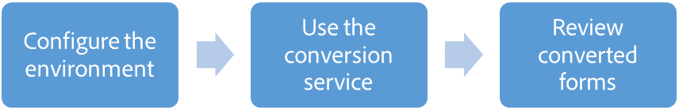

# Introduction to Automated Forms Conversion service{#introduction-to-automated-forms-conversion-service}

Automated Forms Conversion service helps accelerate digitization and modernization of data capture experience through automated conversion of print forms to adaptive forms. The service, powered by Adobe Sensei, automatically converts your PDF forms to device-friendly and responsive adaptive forms. While leveraging the existing investments in PDF Forms, the service also applies appropriate validations to adaptive form fields during conversion. The service helps:

* Save manual effort required to convert print forms to adaptive forms
* Generate reusable adaptive form fragments
* Generate Document of Record during conversion
* Apply patterns and appropriate validations during conversion
* Enables Adobe Analytics during conversion

<!--
Comment Type: annotation
Last Modified By: asgupta
Last Modified Date: 2018-11-21T07:45:55.878-0500
Can a visual help better? Lots of bullet points to read for an overview. Or reduce word count. One way is to not write full sentences.
-->

<!--
Comment Type: annotation
Last Modified By: asgupta
Last Modified Date: 2018-11-21T07:45:19.346-0500
effort not labour. Also, labor not labour.
-->

## Onboarding {#onboarding}

<!--
Comment Type: annotation
Last Modified By: asgupta
Last Modified Date: 2018-11-21T07:11:53.395-0500
Sounds like it should come before workflow. If it must come after w/f then elaborate in title what is being overboarded. Gerund.
-->

The service is available for free to AEM Forms 6.4 and later On-Premise term customers and Adobe Managed Service enterprise customers. To request access to the service for your organization, send an email to [afc-beta@adobe.com](mailto:afc-beta@adobe.com) with the following details:

* Name of your organization or business unit.  
* Name, email address, and designation of an AEM administrator. Create an Adobe ID with similar email address.  
* Geographic region and country of the administrator and other users. For example, EMEA, APAC, U.S.A.

Adobe will enable access for your organization, provide required privileges to the administrator, and a link to Adobe I/O. The administrator can configure and connect your local AEM instance with Automated Forms Conversion service running on Adobe Cloud. See [integrate the Automated Forms Conversion service](configure-the-automated-forms-conversion-service.md) for details.

<!--
Comment Type: annotation
Last Modified By: asgupta
Last Modified Date: 2018-11-21T07:05:29.754-0500
Branding. Adobe I/O
-->

<!--
Comment Type: annotation
Last Modified By: asgupta
Last Modified Date: 2018-11-21T07:56:03.973-0500
Froms?!
-->

## Supported languages and PDF forms {#supported-languages-and-pdf-forms}

<!--
Comment Type: annotation
Last Modified By: asgupta
Last Modified Date: 2018-11-21T07:11:38.823-0500
title case.
-->

<!--
Comment Type: annotation
Last Modified By: khsingh
Last Modified Date: 2018-11-21T09:33:33.003-0500

-->

The service converts only English-language forms to adaptive forms. You can translate the output adaptive forms to another language using [AEM translation workflow](https://helpx.adobe.com/experience-manager/6-5/forms/using/using-aem-translation-workflow-to-localize-adaptive-forms.html).

The service supports PDF forms created with any version of AEM Forms or Adobe LiveCycle, going all the way back to AEM 6.0 Forms and Adobe LiveCycle ES3. The service also supports forms created with Adobe Acrobat.

The service supports non-interactive PDF forms, AcroForms, and XFA-based forms. [AcroForms and XFA-based forms has a limited support](/known-issues/jcr:content.md).

<!--
Comment Type: annotation
Last Modified By: asgupta
Last Modified Date: 2018-11-21T07:06:12.689-0500
Not part of w/f topic. Remove. Link to RNs.
-->

<!--
Comment Type: annotation
Last Modified By: asgupta
Last Modified Date: 2018-11-21T07:54:23.519-0500
using, not with.
-->

<!--
Comment Type: annotation
Last Modified By: asgupta
Last Modified Date: 2018-11-21T07:54:57.761-0500
English-language forms.
-->

## Conversion workflow  {#conversion-workflow}

<!--
Comment Type: annotation
Last Modified By: asgupta
Last Modified Date: 2018-11-21T06:49:26.826-0500
Need better title. Also, use sentence case.
-->

Automated Forms Conversion service runs on Adobe Cloud. You connect your AEM instance to the service, upload print forms to your AEM instance, and start the conversion. The complete conversion process is as listed below:

<!--
Comment Type: annotation
Last Modified By: asgupta
Last Modified Date: 2018-11-21T07:17:59.738-0500
Remove parenthetical content. These must already be covered below in detailed steps. From overview of this H1, no need to mention all details.
-->

### 1. Set up the environment {#set-up-the-environment}

<!--
Comment Type: remark
Last Modified By: Khushwant Singh (khsingh)
Last Modified Date: 2018-11-21T08:57:03.211-0500

Call out these 3 top-level steps before details start.

Can be just an UL or a quick diagram (<a href="https://helpx.adobe.com/content/dam/help/en/experience-manager/6-4/sites/administering/using/rich-text-editor/jcr_content/main-pars/image_2035059177/rte_workflow_v1.png" target="_blank">example</a>).  

<ul>
<li>Configure the environment</li>
<li>Use the conversion service</li>
<li>Review converted forms</li>
</ul>
-->

Automated Forms Conversion service runs on Adobe Cloud. [Configure your local AEM Instance and Adobe I/O account](configure-the-automated-forms-conversion-service.md) to connect to the conversion service running on Adobe Cloud.

<!--
Comment Type: annotation
Last Modified By: asgupta
Last Modified Date: 2018-11-21T07:22:56.068-0500
with keywords?
-->

<!--
Comment Type: annotation
Last Modified By: asgupta
Last Modified Date: 2018-11-21T07:23:28.361-0500
are all mapped...
-->

<!--
Comment Type: annotation
Last Modified By: asgupta
Last Modified Date: 2018-11-21T07:23:39.508-0500
Space.
-->

<!--
Comment Type: annotation
Last Modified By: asgupta
Last Modified Date: 2018-11-21T07:24:58.106-0500
Another idea to lessen the word count is to hyphenate like "organization-specific mapping and properties." 4 instead of 7 words :)
-->

<!--
Comment Type: annotation
Last Modified By: asgupta
Last Modified Date: 2018-11-21T07:25:50.144-0500
via email. Or just remove via email to shorten.
-->

<!--
Comment Type: annotation
Last Modified By: asgupta
Last Modified Date: 2018-11-21T07:26:13.167-0500
AEM instance.
-->

<!--
Comment Type: annotation
Last Modified By: asgupta
Last Modified Date: 2018-11-21T07:26:38.640-0500
for conversion.
-->

<!--
Comment Type: annotation
Last Modified By: asgupta
Last Modified Date: 2018-11-21T07:31:40.657-0500
Can re-write as, "Install AEM Forms add-on package to avail AEM Forms capabilities and Conversion Manager package to avail x, y, and z."
-->

<!--
Comment Type: draft

<ol>
<li>
<strong>Install AEM Forms add-on package and Conversion Manager package:</strong> Install <a href="aem-forms-automated-forms-conversion-service-beta.md" target="_blank">AEM Forms add-on package</a> to avail AEM Forms capabilities and <a href="aem-forms-automated-forms-conversion-service-beta.md" target="_blank">Conversion Manager</a> package to avail conversion service capabilities.
 </li>
<li>
<strong>Create an adaptive form theme:</strong> You can use a theme to provide a unique or organization-specific appearance to your adaptive forms. You can apply an out-of-the-box theme provided with adaptive forms or <a href="https://helpx.adobe.com/experience-manager/6-5/forms/using/themes.html">create a custom theme</a> of your own.
 </li>
<li>
<strong>Create an adaptive form template: </strong>A template contains a set of adaptive form components common for a set of forms. For example, identical header, footer, and logo for the forms of an organization. You can use the <a href="https://helpx.adobe.com/experience-manager/6-5/forms/using/template-editor.html">template editor</a> to create a template. 
 </li>
<li>
<strong>Configure email notifications:</strong> <a href="configure-the-automated-forms-conversion-service.md#main-pars-header-393337952">Configure email-service</a> to receive the status of conversion.
 </li>
<li>
<strong>Configure the cloud service:</strong> Create a <a href="configure-the-automated-forms-conversion-service.md#configure-the-cloud-service">cloud service configuration</a> to connect your AEM instance to the conversion service. It also allows you to specify a template, theme, and form fragments for conversion.
 </li>
<li>
<strong>(Optional) Customize meta-model:</strong> Meta-model defines mapping for all the adaptive form components. For example, a print form field with keywords phone, telephone, mobile phone, work phone, home phone, telephone number, telephone no, and phone number are all mapped to the adaptive form’s telephone component. It also allows the service to pre-configure validations, rules, data patterns, help text, and accessibility properties of adaptive form components. <a href="https://helpx.adobe.com/experience-manager/6-5/forms/using/wip/extending-the-default-meta-model.html">Extend the default meta-model</a> to add organization-specific mapping and validations.
 </li>
</ol>
-->

### 2. Use the conversion service {#use-the-conversion-service}

After your AEM Forms environment is configured, to convert your print forms to adaptive forms, [upload source forms](convert-existing-forms-to-adaptive-forms.md) to your AEM instance and [start the conversion](convert-existing-forms-to-adaptive-forms.md#run-the-conversion). Before uploading the forms, consider the following:

* Do not upload the protected forms. The service does not convert password-protected and encrypted forms. 
* Do not upload scanned, coloured, non-English language, and filled forms. Such forms are not supported.  
* Do not upload source forms with spaces in the filename.  
* Make the suggested changes in source forms described in the [Best practices and considerations](https://helpx.adobe.com/experience-manager/6-5/forms/using/wip/styles-and-pattern--considerations-and-best-practices-.html) article.
* Read the [Known issues](aem-forms-automated-forms-conversion-service-beta.md) article to avoid pitfalls.

<!--
Comment Type: draft

<ol>
<li></li>
<li>
<strong>Start the conversion</strong>: Select the folder containing the print forms and <a href="convert-existing-forms-to-adaptive-forms.md#run-the-conversion" target="_blank">start the conversion</a>. On the dialog box, select a cloud service configuration, specify output location, and click start conversion. Source forms are uploaded to Adobe Cloud for conversion.
 </li>
<draft-comment type="draft">
<li>Step text</li>
</draft-comment>
<draft-comment type="draft">
<li>Step text</li>
</draft-comment>
<draft-comment type="draft">
<li>Step text</li>
</draft-comment>
</ol>
-->

### 3. Review converted forms {#review-converted-forms}

Your forms can have complex data capture requirements. Once automated conversion is complete, you can use the [Review and Correct editor](review-correct-ui-edited.md) to review converted form and make necessary updates and generate an enhanced output closer to desired experience. After making required changes, send the form again for the conversion.

Conversion of a PDF form to an adaptive form could some take time due to multiple factors such as size of input form, complexity of the form, loan on the processing queue of the service. When the conversion is complete, an email notification is sent to configured email address.

<!--
Comment Type: draft

<ol>
<li>
<strong>Set up the environment</strong>: Before starting the conversion, connect your AEM Forms instance to the conversion service running on Adobe I/O, prepare templates, prepare themes, customize meta-model, and configure email service:

<ol>
<li>Install <a href="https://helpx.adobe.com/experience-manager/6-5/forms/using/installing-configuring-aem-forms-osgi.html" target="_blank">AEM Forms add-on package</a> and <a href="configure-the-automated-forms-conversion-service.md#download-and-install-the-connector-package" target="_blank">Conversion Manager package</a>: Install AEM Forms add-on package to avail AEM Forms capabilities and Conversion Manager package to avail conversion service capabilities.  </li>
<li>Create an adaptive form theme: A theme provides a unique appearance and style to an adaptive form. You can apply out of the box themes provided with adaptive forms or <a href="https://helpx.adobe.com/experience-manager/6-5/forms/using/themes.html" target="_blank">create custom themes</a> of your own.</li>
<li>Create an adaptive form template: A template contains a set of adaptive form components common for a set of forms. For example, identical header, footer, and logo for the forms of an organization. You can use the <a href="https://helpx.adobe.com/experience-manager/6-5/forms/using/template-editor.html" target="_blank">template editor</a> to create a template.   </li>
<li>Customize meta-model: Meta-model defines mapping for all the adaptive form components. For example, a print form field with keywords phone, telephone, mobile phone, work phone, home phone, telephone number, telephone no, and phone number are all mapped to the adaptive form’s telephone component. It also allows the service to pre-configure validations, rules, data patterns, help text, and accessibility properties of adaptive form components. <a href="https://helpx.adobe.com/experience-manager/6-5/forms/using/wip/extending-the-default-meta-model.html" target="_blank">Extend the default meta-model</a> to add organization-specific mapping and validations.</li>
<li>Configure email notifications: <a href="configure-the-automated-forms-conversion-service.md#main-pars-header-393337952" target="_blank">Configure email-service</a> to receive the status of conversion.  </li>
<li>Configure cloud services: Create a <a href="configure-the-automated-forms-conversion-service.md#configure-the-cloud-service" target="_blank">cloud service configuration</a> to connect your AEM instance to the conversion service. It also allows you to specify a template, theme, and form fragments for conversion.</li>
</ol>
<draft-comment lastmodifiedby="asgupta" lastmodifieddate="2018-11-21T07:22:56.068-0500" type="annotation">
with keywords?
</draft-comment>
<draft-comment lastmodifiedby="asgupta" lastmodifieddate="2018-11-21T07:23:28.361-0500" type="annotation">
are all mapped...
</draft-comment>
<draft-comment lastmodifiedby="asgupta" lastmodifieddate="2018-11-21T07:23:39.508-0500" type="annotation">
Space.
</draft-comment>
<draft-comment lastmodifiedby="asgupta" lastmodifieddate="2018-11-21T07:24:58.106-0500" type="annotation">
Another idea to lessen the word count is to hyphenate like "organization-specific mapping and properties." 4 instead of 7 words :)
</draft-comment>
<draft-comment lastmodifiedby="asgupta" lastmodifieddate="2018-11-21T07:25:50.144-0500" type="annotation">
via email. Or just remove via email to shorten.
</draft-comment>
<draft-comment lastmodifiedby="asgupta" lastmodifieddate="2018-11-21T07:26:13.167-0500" type="annotation">
AEM instance.
</draft-comment>
<draft-comment lastmodifiedby="asgupta" lastmodifieddate="2018-11-21T07:26:38.640-0500" type="annotation">
for conversion.
</draft-comment>
<draft-comment lastmodifiedby="asgupta" lastmodifieddate="2018-11-21T07:31:40.657-0500" type="annotation">
Can re-write as, "Install AEM Forms add-on package to avail AEM Forms capabilities and Conversion Manager package to avail x, y, and z."
</draft-comment>
<draft-comment color="yellow" lastmodifiedby="asgupta" lastmodifieddate="2018-11-21T07:10:33.343-0500" prevfirstname="Ashish" prevlastname="Gupta ." type="remark">

<strong>Workflow diagram</strong>

Place before detailed text. Ideally, at the beginning and set the sequence of the textual instructions.

Sleek arrows. Too big.

Can add color coding to demarcate AEM and Adobe Cloud.

The icons used in w/f diagram should ideally match with icons used in UI.

Ampersand usage in Review and Correct.  

</draft-comment></li>
<li>
<strong>Use the conversion service</strong>: Use the conversion service to convert print PDF forms available on your AEM Forms instance to adaptive forms. To convert the forms:

<ol>
<li><a href="convert-existing-forms-to-adaptive-forms.md" target="_blank">Upload source forms</a>: Upload the forms to be converted to a folder on your AEM Forms instance. The conversion is run on all the source forms available in the folder.  </li>
<li><a href="convert-existing-forms-to-adaptive-forms.md#run-the-conversion" target="_blank">Start the conversion</a>: Select the folder containing the source forms and start the conversion. On the dialog box, select a cloud service configuration, specify output location, and click start conversion. Source forms are uploaded to Adobe Cloud for conversion.</li>
</ol> 
On successful conversion, an adaptive form and its schema are generated and downloaded to your AEM Forms instance. Adaptive forms fragments its schemas are also generated, if applicable.

<draft-comment lastmodifiedby="asgupta" lastmodifieddate="2018-11-21T07:35:20.093-0500" type="annotation">
Conversion service supports only x,y,andz.
</draft-comment>
<draft-comment lastmodifiedby="asgupta" lastmodifieddate="2018-11-21T07:48:01.424-0500" type="annotation">
the dialog is not named start conversion.
</draft-comment>
<draft-comment lastmodifiedby="asgupta" lastmodifieddate="2018-11-21T07:49:31.255-0500" type="annotation">
The second half of 2.b is not about starting the conversion. It is conceptual info about post-conversion.
</draft-comment></li>
<li>
<strong>Review converted forms</strong>: Your forms can have complex data capture requirements. Once automated conversion is complete, you can use the <a href="review-correct-ui-edited.md" target="_blank">Review and Correct editor</a> to review converted form and make necessary updates and generate an enhanced output closer to desired experience. After making required changes, resend the forms to the conversion service. 
 
Conversion of a PDF form to an adaptive form might take some time based on the load on the Adobe I/O servers. When the conversion is complete, an email notification is sent to configured email address.
  
<draft-comment lastmodifiedby="asgupta" lastmodifieddate="2018-11-21T07:09:03.159-0500" type="annotation">
Ampersand?
</draft-comment>
<draft-comment lastmodifiedby="asgupta" lastmodifieddate="2018-11-21T07:51:33.029-0500" type="annotation">
I think it should be real-world. Not sure. Check in Acrolinx.
</draft-comment>
<draft-comment lastmodifiedby="asgupta" lastmodifieddate="2018-11-21T07:52:25.596-0500" type="annotation">
Just say, you can review converted form to make necessary updates.... Saying review quality of conversion may hint that there are issues with quality :)
</draft-comment>
<draft-comment lastmodifiedby="asgupta" lastmodifieddate="2018-11-21T07:52:46.752-0500" type="annotation">
the required
</draft-comment>
<draft-comment lastmodifiedby="asgupta" lastmodifieddate="2018-11-21T07:53:44.175-0500" type="annotation">
Are the forms automatically sent? If yes, then this is correct. Just FYI conceptual info. If not automatically sent, then mention as actionable info. "After making the required changes, re-send the forms to the conversion service."
</draft-comment></li>
<draft-comment type="draft">
<li>Step text</li>
</draft-comment>
<draft-comment type="draft">
<li>Step text</li>
</draft-comment>
</ol>
-->

<!--
Comment Type: draft

<h2>Prerequisites </h2>
-->

<!--
Comment Type: draft

Before you can use the Automated Forms Conversion service, ensure the following to create an integration on Adobe I/O:

<ul>
<li>An Adobe ID account that has administrator privileges for the organization.</li>
<li>The Automated Forms Conversion service is enabled for your organization.</li>
</ul>
-->

## Next {#next}

[Configure the Automated Forms Conversion service](configure-the-automated-forms-conversion-service.md)
