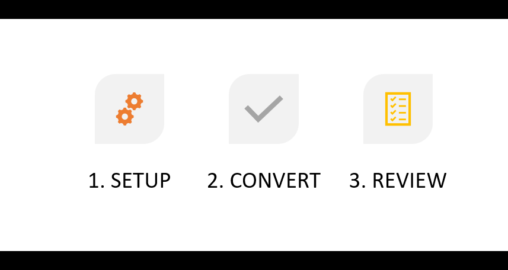

# Introduction {#introduction-to-automated-forms-conversion-service}

Automated Forms Conversion service helps accelerate digitization and modernization of data capture experience through automated conversion of PDF forms to adaptive forms. The service, powered by Adobe Sensei, automatically converts your PDF forms to device-friendly, responsive, and HTML5-based adaptive forms. While leveraging the existing investments in PDF Forms and XFA, the service also applies appropriate validations, styling, and layout to adaptive form fields during conversion. The service helps:

* Save manual effort required to convert print forms to adaptive forms
* Applies patterns and appropriate validations during conversion
* Generate Document of Record during conversion
* Group commonly occuring fields into reusable form fragments
* Enables Adobe Analytics during conversion

## Onboarding {#onboarding}

The service is available for free to AEM  6.5 Forms On-Premise term customers and Adobe Managed Service enterprise customers. You can contact Adobe Sales team or your Adobe representative to request access to the service.

Adobe enables access for your organization and provide required privileges to the person designated as administrator in your organization. The administrator can grant access to your AEM Forms developers (users) of your organization to connect to the service. See [Configure the Automated Forms Conversion service](configure-service.md) for details.

## Supported PDF forms and langugaes {#supported-languages-and-pdf-forms}

The service supports non-interactive PDF forms, Forms created with Adobe Acrobat known as AcroForms, and XFA-based created using AEM Forms or Adobe LiveCycle.

The service can convert only English-language forms to adaptive forms. You can translate the generated adaptive forms to another language using [AEM translation workflow](https://helpx.adobe.com/experience-manager/6-5/forms/using/using-aem-translation-workflow-to-localize-adaptive-forms.html).

## Conversion workflow  {#conversion-workflow}

Automated Forms Conversion service runs on Adobe Cloud. You connect your AEM instance to the service, upload forms to your AEM instance, and start the conversion. The complete conversion process is as listed below:

### 1. Set up the environment {#set-up-the-environment}

Automated Forms Conversion service runs on Adobe Cloud. [Configure Adobe I/O account of your organization and connect your local AEM instance](configure-service.md) to the conversion service running on Adobe Cloud.

### 2. Convert PDF forms to adaptive forms {#use-the-conversion-service}

After your AEM Forms environment is configured, to convert your PDF forms to adaptive forms, [upload PDF forms](convert-existing-forms-to-adaptive-forms.md) to your AEM instance and [start the conversion](convert-existing-forms-to-adaptive-forms.md#run-the-conversion). Before uploading the forms, consider the following:

* Do not upload the secured forms. The service does not convert password-protected and encrypted forms.
* Do not upload scanned, coloured, non-English language, and filled forms. Such forms are not supported.  
* Do not upload PDF forms with spaces in the filename.
* Do not upload [PDF Portfolios](https://helpx.adobe.com/acrobat/using/overview-pdf-portfolios.html). The service does not convert a PDF Portfolio to an adaptive forms.
* Make the suggested changes in PDF forms described in the [Best practices and considerations](styles-and-pattern-considerations-and-best-practices.md) article.
* Read the [Known issues](known-issues.md) article to avoid pitfalls.

### 3. Review converted forms {#review-converted-forms}

Real world forms can have complex data capture requirements in terms of field layout, naming or implicit suggestions which may not be accurately captured by AI/ML based detection logic. Once automated conversion is complete, you can use the [Review and Correct editor](review-correct-ui-edited.md) to review converted form and make necessary updates and generate an enhanced output closer to desired experience. After making required changes, send the form again for the conversion.

The time taken for automated conversion depends on a variety of factor such as size of input form, complexity of the form, loan on the processing queue of the service. The user is notified of the progress regularly via status indicator on folder / file. When the conversion is complete, an email notification is also sent to configured email address.
