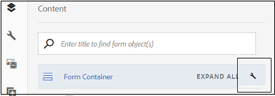
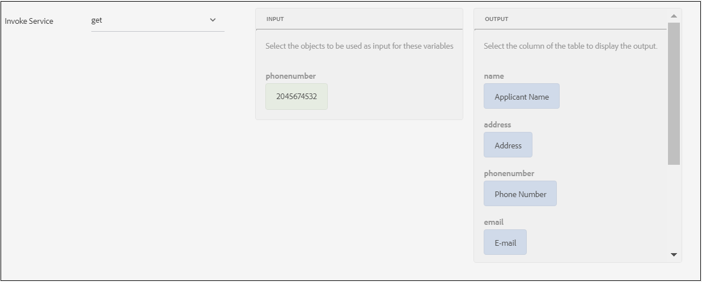
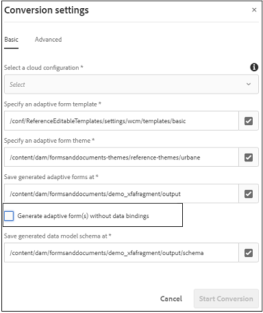

# Recommended data source-based prefill and submit workflows for adaptive forms {#recommended-data-source-btased-prefill-and-submit-workflows-for-adaptive-forms}

You can use any of the following data sources with adaptive forms converted using Automated Forms Conversion service:

* Form data model, OData, or any other third-party service
* JSON schema
* XSD schema

Based on the data source, you can choose to generate an adaptive form with or without a data model.

This article describes the recommended workflows to prefill field values and submission options after selecting a data source and generating an adaptive form using the conversion service.

<table> 
 <tbody> 
  <tr> 
   <th><strong>Data Source</strong></th> 
   <th><strong>Recommended workflow</strong></th> 
  </tr> 
  <tr> 
   <td><p>Form data model, OData, or any other third-party service</p></td> 
   <td> 
    <p><strong>Option 1</strong>: You select form data model, OData, or any other third-party service as the data source. You <a href="#generate-adaptive-forms-with-no-data-binding">generate an adaptive form with no data binding</a> using the Automated Forms Conversion service. You bind the adaptive form fields to form data model entities manually and use the Form Data Model Prefill Service option to prefill field values. You use the Submit using Form Data Model option to submit the adaptive form.</br><strong>Option 2</strong>: You select form data model, OData, or any other third-party service as the data source. You <a href="#generate-adaptive-forms-with-no-data-binding">generate an adaptive form with no data binding</a> using the Automated Forms Conversion service. You bind the adaptive form fields using the rule editor to prefill field values. Modify the field values, if necessary, and submit data to the crx-repository.<br>For step-by-step instructions to execute these workflows, see <a href="#sqldatasource">Use database, OData, or any third-party service as the data source.</a></p> </td> 
  </tr>
  <td><p>JSON Schema</p></td> 
   <td> 
    <p>You select JSON schema as the data source. Based on the selected data source:</br><strong>Option 1</strong>: You <a href="#generate-adaptive-forms-with-no-data-binding">generate an adaptive form with no data binding</a> using the Automated Forms Conversion service and configure JSON schema as the data source. You bind the adaptive form fields to JSON schema manually and <a href="https://helpx.adobe.com/experience-manager/6-5/forms/using/prepopulate-adaptive-form-fields.html#Supportedprotocolsforprefillinguserdata" target="_blank">use any of the supported protocols</a> to prefill field values. Modify the field values, if necessary, and submit data to the crx-repository.<br>For step-by-step instructions to execute the workflows, see <a href="#jsondatasource">Use JSON schema as the data source.</a></br><strong>Option 2</strong>: You <a href="#generate-adaptive-forms-with-json-binding">generate an adaptive form with JSON data binding</a> using the Automated Forms Conversion service. The prefill service and form submission function seamlessly. You do not need any configuration steps.<br>For step-by-step instructions to execute the workflows, see <a href="#jsonwithdatabinding">Use JSON schema as the data source.</a></p> </td> 
  </tr>
  <td><p>XSD schema</p></td> 
   <td> 
    <p>You select XSD schema as the data source. Based on the selected data source, you <a href="#generate-adaptive-forms-with-no-data-binding">generate an adaptive form with no data binding</a> using the Automated Forms Conversion service and configure XSD schema as the data source. You bind the adaptive form fields to XSD schema manually and <a href="https://helpx.adobe.com/experience-manager/6-5/forms/using/prepopulate-adaptive-form-fields.html#Supportedprotocolsforprefillinguserdata" target="_blank">use any of the supported protocols</a> to prefill field values. Modify the field values, if necessary, and submit data to the crx-repository.<br>For step-by-step instructions to execute the workflows, see <a href="#xsddatasource">Use XSD schema as the data source.</a></p>
    </td> 
  </tr>
 </tbody> 
</table>

For more information on the Automated Forms Conversion service, see the following articles:

* [Introduction to Automated Forms Conversion service](introduction-to-automated-form-conversion-service.md)
* [Configure the Automated Forms Conversion service](configure-the-automated-forms-conversion-service.md)
* [Convert print forms to adaptive forms](convert-existing-forms-to-adaptive-forms.md)
* [Review and correct converted forms](review-correct-ui-edited.md)

The information provided in this article is based on the assumption that anyone reading it has basic knowledge of adaptive forms concepts.

## Pre-requisites {#pre-requisites}

* Configure an [AEM author instance](https://helpx.adobe.com/experience-manager/6-5/sites/deploying/using/deploy.html)
* Configure [Automated Forms Conversion service on the AEM author instance](configure-the-automated-forms-conversion-service.md)

## Sample adaptive form {#sample-adaptive-form}

To execute the use cases to prefill field values in an adaptive form and submit them to the data source, download the following sample PDF file.

Sample loan application form

[Get File](assets/sample_loan_application_form.pdf)
The PDF file serves as the input to the Automated Forms Conversion service. The service converts this file to an adaptive form. The following image depicts the sample loan application in a PDF format.


## Prepare data for form model {#prepare-data-for-form-model}

AEM Forms Data Integration allows you to configure and connect to disparate data sources. After generating an adaptive form using the conversion process, you can define the form model based on a form data model, XSD, or a JSON schema. You can use a database, Microsoft Dynamics, or any other third-party service to create a form data model.

This tutorial uses the MySQL database as the source to create a form data model. Create a **loanapplication** schema in the database and add an **applicant** table to the schema based on the fields that are available in the adaptive form.


You can use the following DDL statement to create the **applicant** table in database.

```sql
CREATE TABLE `applicant` (
   `name` varchar(45) DEFAULT NULL,
   `address` varchar(45) DEFAULT NULL,
   `phonenumber` int(11) NOT NULL,
   `email` varchar(45) DEFAULT NULL,
   `occupation` varchar(45) DEFAULT NULL,
   `annualsalary` varchar(45) DEFAULT NULL,
   `familymembers` int(11) DEFAULT NULL,
   PRIMARY KEY (`phonenumber`)
 ) ENGINE=InnoDB DEFAULT CHARSET=utf8
```

If you are using an XSD schema as the form model to execute the use cases, create an XSD file with the following text:

```xml
<?xml version="1.0" encoding="utf-8" ?>
    <xs:schema targetNamespace="http://adobe.com/sample.xsd"
                    xmlns="http://adobe.com/sample.xsd"
                    xmlns:xs="http://www.w3.org/2001/XMLSchema">

<xs:element name="sample" type="SampleType"/>

  <xs:complexType name="SampleType">
    <xs:sequence>
      <xs:element name="name" type="xs:string"/>
   <xs:element name="address" type="xs:string"/>
   <xs:element name="phonenumber" type="xs:int"/>
   <xs:element name="email" type="xs:string"/>
   <xs:element name="occupation" type="xs:string"/>
   <xs:element name="annualsalary" type="xs:string"/>
   <xs:element name="familymembers" type="xs:string"/>
 </xs:sequence>
  </xs:complexType>

  </xs:schema>
```

Or download the XSD schema to the local file system.

Sample loan application XSD schema

[Get File](assets/loanapplication.xsd)

For more information on using XSD schema as the form model in adaptive forms, see [Creating adaptive forms using XML schema](https://helpx.adobe.com/experience-manager/6-5/forms/using/adaptive-form-xml-schema-form-model.html).

If you are using a JSON schema as the form model to execute the use cases, create a JSON file with the following text:

```JSON
{
    "$schema": "http://json-schema.org/draft-04/schema#",
    "definitions": {
        "loanapplication": {
            "type": "object",
            "properties": {
                "name": {
                    "type": "string"
                },
                "address": {
                    "type": "string"
                },
    "phonenumber": {
                    "type": "number"
                },
    "email": {
                    "type": "string"
                },
    "occupation": {
                    "type": "string"
                },
    "annualsalary": {
                    "type": "string"
                },
    "familymembers": {
                    "type": "number"
                }
            }
        }
 },
 "type": "object",
    "properties": {
        "employee": {
            "$ref": "#/definitions/loanapplication"
        }
    }
}

```

Or download the JSON schema to the local file system.

Sample loan application JSON schema

[Get File](assets/demo_schema.json)
For more information on using JSON schema as the form model in adaptive forms, see [Creating adaptive forms using JSON schema](https://helpx.adobe.com/experience-manager/6-5/forms/using/adaptive-form-json-schema-form-model.html).

## Generate adaptive forms with no data binding {#generate-adaptive-forms-with-no-data-binding}

Use the [Automated Forms Conversion service to convert](convert-existing-forms-to-adaptive-forms.md) the [sample loan application form](#sample-adaptive-form) to an adaptive form with no data binding. Ensure that you select the **[!UICONTROL Generate adaptive form(s) without data bindings]** check box to generate the adaptive form with no data binding.


After generating an adaptive form with no data binding, select a data source for the adaptive form:

* [Database, OData, or any third-party service](#sqldatasource)
* [JSON schema](#jsondatasource)
* [XSD schema](#xsddatasource)

### Use database, OData, or any third-party service as the data source {#sqldatasource}

Use Case: You generate an adaptive form with no data binding using the Automated Forms Conversion service and configure MYSQL database as the data source. You bind the adaptive form fields to form data model entities manually and use the **[!UICONTROL Form Data Model Prefill Service]** option to prefill field values. You use the **[!UICONTROL Submit using Form Data Model]** option to submit the adaptive form.

Before executing the use case:

* [Configure MySQL database as the data source](https://helpx.adobe.com/experience-manager/6-5/forms/using/configure-data-sources.html#configurerelationaldatabase)
* [Create the form data model](https://helpx.adobe.com/experience-manager/6-5/forms/using/work-with-form-data-model.html)

Based on the use case, create the **loanapplication** form data model and bind read service argument to a **[!UICONTROL Literal]** value. The phone number literal value must be of one of the records configured in the **applicant** schema of the MySQL database. The services use the value as an argument to fetch details from the data source. You can also select [User Profile Attribute or Request Attribute](https://helpx.adobe.com/experience-manager/6-5/forms/using/work-with-form-data-model.html#bindargument) from the **[!UICONTROL Binding To]** drop-down list


>[!NOTE]
>
>Ensure that you add **get** and **insert** services to the form data model, configure, and test the services before executing the use case.

Execute the following steps:

1. Select the converted **sample loan application form** available in the **[!UICONTROL output]** folder and tap **[!UICONTROL Properties]**.
1. Tap the **[!UICONTROL Form Model]** tab, select **[!UICONTROL Form Data Model]** from the **[!UICONTROL Select From]** drop-down list, and tap **[!UICONTROL Select Form Data Model]** to select the **loanapplication** form data model. Tap **[!UICONTROL Save & Close]** to save the form.
1. Select the **sample loan application form** and tap **[!UICONTROL Edit]**.
1. In the **[!UICONTROL Content]** tab, tap the configure icon:

   

    1. In the **[!UICONTROL Basic]** section, select **[!UICONTROL Form Data Model Prefill service]** from the **[!UICONTROL Prefill Service]** drop-down list.

    1. In the **[!UICONTROL Submission]** section, select **[!UICONTROL Submit using Form Data Model]** from the **[!UICONTROL Submit Action]** drop-down list.

    1. Select the data model using the **[!UICONTROL Data Model to submit]** field.
    1. Tap  to save the properties.

1. Tap the Applicant Name text box and select  (Configure).

    1. In the Bind Reference field, select **Applicant** &gt; **Name**, and tap  to save the properties. Similarly, create a data binding for the **Address**, **Phone Number**, **E-mail**, **Occupation**, **Annual Salary (in dollars)**, and **No. of dependent family members** fields with the form data model entities.

   

1. Tap **[!UICONTROL Preview]** to view the prefilled adaptive form field values.
1. Modify the field values, if necessary, and submit the adaptive form. The field values are submitted to the MySQL database. You can refresh the **applicant** table in the database to view the updated values in the table.

**Use Case:** You generate an adaptive form with no data binding using the Automated Forms Conversion service and configure MYSQL database as the data source. You bind the adaptive form fields using the rule editor to prefill field values. Modify the field values, if necessary, and submit data to the crx-repository.

Execute the following steps to use [rule editor](https://helpx.adobe.com/experience-manager/6-5/forms/using/rule-editor.html) to invoke form data model service to bind fields and prefill values in an adaptive form:

1. Select the **sample loan application form** in the **[!UICONTROL output]** folder and tap **[!UICONTROL Edit]**.
1. In the **[!UICONTROL Content]** tab, tap the configure icon:

   

   In the **[!UICONTROL Basic]** section, select **[!UICONTROL Form Data Model Prefill service]** from the **[!UICONTROL Prefill Service]** drop-down list.

1. Tap the **[!UICONTROL Applicant Name]** text box and tap **[!UICONTROL Edit Rules]**.

   

1. Tap **[!UICONTROL Create]** on the Rule Editor page.
1. On the **[!UICONTROL Rule Editor]** page:

    1. Select a state for the Applicant Name text box. For example, **[!UICONTROL is initialized]**, which results in execution of the **[!UICONTROL Then]** condition when you render the form in **[!UICONTROL Preview]** mode.

    1. In the **[!UICONTROL Then]** section, select **[!UICONTROL Invoke Service]** from the **[!UICONTROL Select Action]** drop-down list. All services on your Forms instance display in the drop-down list.

    1. Select a **[!UICONTROL Get]** service from the section listing the form data models. The Input field displays **phonenumber**, which is the primary key defined for the **applicant** data model. The system retrieves and prefills the values in the adaptive form for fields in the Output section based on this field.

    1. Create a binding for the adaptive form fields with the form data model entities using the Output section. For example, bind **[!UICONTROL Applicant Name]** adaptive form field with the **name** entity.

    1. Tap **[!UICONTROL Done]**. Tap **[!UICONTROL Done]** again on the Rule Editor page.

   

1. Tap **[!UICONTROL Preview]** to view the prefilled adaptive form field values.

   >[!NOTE]
   >
   >Ensure that the **[!UICONTROL Return Array]** Property is set to OFF for the **get** service property in the form data model associated with the adaptive form.

1. Modify the field values, if necessary, and submit the adaptive form. The submitted data is available at the following location in the crx-repository:

   `http://host name:port/crx/de/index.jsp#/content/forms/fp/admin/submit/data/latest file available in the folder`

### Use JSON schema as the data source {#jsondatasource}

**Use Case:** You generate an adaptive form with no data binding using the Automated Forms Conversion service and configure JSON schema as the data source. You bind the adaptive form fields to JSON schema manually and use the **crx:// protocol** to prefill field values. Modify the field values, if necessary, and submit data to the crx-repository.

Before executing the use case, ensure that you have:

* [a valid JSON schema compliant with the JSON schema structure](#prepare-data-for-form-model)
* [an adaptive form with no data binding](#generate-adaptive-forms-with-no-data-binding)

Execute the following steps:

1. Select the converted **sample loan application form** available in the **output** folder and tap **[!UICONTROL Properties]**.
1. Tap the **[!UICONTROL Form Model]** tab, select **[!UICONTROL Schema]** from the **[!UICONTROL Select From]** drop-down list, and tap **[!UICONTROL Select Schema]** to upload the **demo.schema JSON** schema saved on the local file system. Tap **[!UICONTROL Save & Close]** to save the form.
1. Select the **sample loan application form** and tap **[!UICONTROL Edit]**.
1. Tap the Applicant Name text box and select  (Configure).

    In the Bind Reference field, select **Applicant** &gt; **Name**, and tap  to save the properties. Similarly, create a data binding for the **Address**, **Phone Number**, **E-mail**, **Occupation**, **Annual Salary (in dollars)**, and **No. of dependent family members** fields with the JSON schema entities.

1. Select the converted **sample loan application form** available in the **[!UICONTROL output]** folder again and select **[!UICONTROL Preview]** > **[!UICONTROL Preview with Data]**. If you use the **[!UICONTROL Preview with Data]** option to view values in adaptive form fields, skip to step 9 of these instructions. Else, you can ignore this step.

1. Create a file with data to prefill values in the adaptive form. Tap **[!UICONTROL Download]** to download a sample file.

   Sample data file

   [Get File](assets/samplexmldata.zip)
   As an example, use the crx:// protocol to prefill user data in the adaptive
   form. You can also use [other protocols](https://helpx.adobe.com/experience-manager/6-5/forms/using/prepopulate-adaptive-form-fields.html#supportedprotocolsforprefillinguserdata) to prefill data.

1. Create a file in the crx-repository and copy the content of the sample data file to the file in crx-repository. For example, create a file at: */content/loan_application_data_json*
1. Tap **[!UICONTROL Preview]** and edit the URL of the page to:

   `http://host name:port/editor.html/content/forms/af/Name of adaptive form.html?wcmmode=disabled&dataRef=crx://file path including slash`

   For example, `http://localhost:4502/editor.html/content/forms/af/sample_loan_application_form-copy.html?wcmmode=disabled&dataRef=crx:///content/create_loan_application_data_json`

   The values in the adaptive form display based on the data available in the crx-repository file created in step 6.

1. Modify the field values, if necessary, and submit the adaptive form. The submitted data is available at the following location in the crx-repository:

   `http://host name:port/crx/de/index.jsp#/content/forms/fp/admin/submit/data/latest file available in the folder`

### Use XSD schema as the data source {#xsddatasource}

**Use Case:** You generate an adaptive form with no data binding using the Automated Forms Conversion service and configure XSD schema as the data source. You bind the adaptive form fields to XSD schema manually and use the **crx:// protocol** to prefill field values. Modify the field values, if necessary, and submit data to the crx-repository.

Before executing the use case, ensure that you have:

* [a valid XSD schema compliant with the XML schema structure](#prepare-data-for-form-model)
* [an adaptive form with no data binding](#generate-adaptive-forms-with-no-data-binding)

Execute the following steps:

1. Select the converted **sample loan application form** available in the **[!UICONTROL output]** folder and tap **[!UICONTROL Properties]**.
1. Tap the **[!UICONTROL Form Model]** tab, select **[!UICONTROL Schema]** from the **[!UICONTROL Select From]** drop-down list, and tap **[!UICONTROL Select Schema]** to upload the **loanapplication** XSD schema saved on the local file system. Select root element for the XSD schema and tap **[!UICONTROL Save & Close]** to save the form.
1. Select the **sample loan application form** and tap **[!UICONTROL Edit]**.
1. Tap the Applicant Name text box and select  (Configure).
In the Bind Reference field, select **Applicant** &gt; **Name**, and tap  to save the properties. Similarly, create a data binding for the **Address**, **Phone Number**, **E-mail**, **Occupation**, **Annual Salary (in dollars)**, and **No. of dependent family members** fields with the XSD schema entities.

1. Select the converted **sample loan application form** available in the **output** folder again and select **[!UICONTROL Preview]** > **[!UICONTROL Preview with Data]**. If you use the **[!UICONTROL Preview with Data]** option to view values in adaptive form fields, skip to step 9 of these instructions. Else, you can ignore this step.

1. Create an XML file with data to prefill values in the adaptive form. Tap **[!UICONTROL Download]** to download a sample file.

   Sample XML data file

   [Get File](assets/samplexmldata.zip)

   As an example, use the crx:// protocol to prefill user data in the adaptive form. You can also use [other protocols](https://helpx.adobe.com/experience-manager/6-5/forms/using/prepopulate-adaptive-form-fields.html#supportedprotocolsforprefillinguserdata) to prefill data.

1. Create a file in the crx-repository and copy the content in the XML file to the crx-repository file. For example, create a file at: */content/loan_application_data*
1. Tap **[!UICONTROL Preview]** and edit the URL of the page to:

   `http://host name:port/editor.html/content/forms/af/Name of adaptive form.html?wcmmode=disabled&dataRef=crx://file path including slash`

   For example, `http://localhost:4502/editor.html/content/forms/af/sample_loan_application_form.html?wcmmode=disabled&dataRef=crx:///content/loan_application_data`

   The values in the adaptive form display based on the data available in the XML file.

1. Modify the field values, if necessary, and submit the adaptive form. The submitted data is available at the following location in the crx-repository:

   `http://host name:port/crx/de/index.jsp#/content/forms/fp/admin/submit/data/latest file available in the folder`

## Generate adaptive forms with JSON binding {#generate-adaptive-forms-with-json-binding}

Use the [Automated Forms Conversion service to convert](convert-existing-forms-to-adaptive-forms.md) the [sample loan application form](#sample-adaptive-form) to an adaptive form with data binding. Ensure that you do not select the **[!UICONTROL Generate adaptive form(s) without data bindings]** check box while generating the adaptive form.



### Use JSON schema as the data source {#jsonwithdatabinding}

**Use Case:** You generate an adaptive form with JSON data binding using the Automated Forms Conversion service. The prefill service and form submission function seamlessly. You do not need any configuration steps.

Before executing the use case, ensure that you have:

* [an adaptive form with data binding](#generate-adaptive-forms-with-json-binding)

Execute the following steps:

1. Select the converted **sample loan application form** available in the **[!UICONTROL output]** folder again and select **[!UICONTROL Preview]** > **[!UICONTROL Preview with Data]**. If you use the **[!UICONTROL Preview with Data]** option to view values in adaptive form fields, skip to step 6 of these instructions. Else, you can ignore this step.

1. Select the **sample loan application form** in the **[!UICONTROL output]** folder and tap **[!UICONTROL Preview]** > **[!UICONTROL Preview as HTML]**.

1. Create a file with data to prefill values in the adaptive form. Tap **[!UICONTROL Download]** to download a sample file.

   Sample data file

   [Get File](assets/loan_application_data_json_binding.txt)
   As an example, use the crx:// protocol to prefill user data in the adaptive form. You can also use [other protocols](https://helpx.adobe.com/experience-manager/6-5/forms/using/prepopulate-adaptive-form-fields.html#supportedprotocolsforprefillinguserdata) to prefill data.

1. Create a file in the crx-repository and copy the content of the sample data file to the file in crx-repository. For example, create a file at: */content/json-prefill*
1. Tap **[!UICONTROL Preview]** and edit the URL of the page to:

   `http://host name:port/editor.html/content/forms/af/Name of adaptive form.html?wcmmode=disabled&dataRef=crx://file path including slash at the start`

   For example, `http://localhost:4502/editor.html/content/forms/af/sample_loan_application_form.html?wcmmode=disabled&dataRef=crx:///content/json-prefill`

   The values in the adaptive form display based on the data available in the sample file.

1. Modify the field values, if necessary, and submit the adaptive form. The submitted data is available at the following location in the crx-repository:

   `http://host name:port/crx/de/index.jsp#/content/forms/fp/admin/submit/data/latest file available in the folder`

## Convert submitted adaptive form JSON data to XML format {#convert-submitted-adaptive-form-data-to-xml}

When you enter values in adaptive form fields and submit it, the data is available in JSON format in the crx-repository. You can convert the format of JSON data to XML either using [org.apache.sling.commons.json.xml](https://sling.apache.org/apidocs/sling5/org/apache/sling/commons/json/xml/XML.html#toString) API or the following sample code:

```
import org.apache.sling.commons.json.JSONException;
import org.apache.sling.commons.json.JSONObject;
import org.apache.sling.commons.json.xml.XML;
 
public class ConversionUtils {
 
    public static String jsonToXML(String jsonString) throws JSONException {
        //https://sling.apache.org/apidocs/sling5/org/apache/sling/commons/json/xml/XML.html#toString(java.lang.Object)
        //jar - http://maven.ibiblio.org/maven2/org/apache/sling/org.apache.sling.commons.json/2.0.18/
        //Note: Need to extract boundData part before converting to XML
        return XML.toString(new JSONObject(jsonString));
    }
}
```
