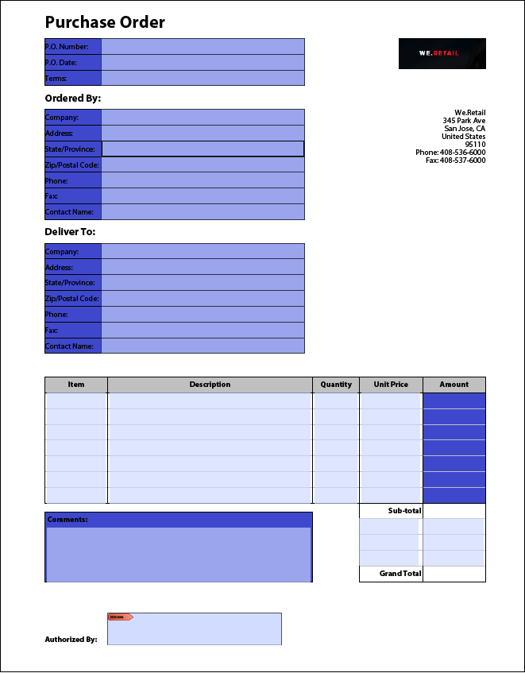

# Best practices and considerations {#Best-practices-and-considerations2}

AEM Forms Automated Conversion service converts a PDF form to an adaptive form. The service uses artificial intelligence and machine learning algorithms to understand the layout and fields of the source form. Every machine learning service continuously learns from source data and produces an improved output with every churn. These services learn from the experience like humans.

Automated Forms Conversion service is trained on a large set of forms. It easily identifies fields in a source form and produces adaptive forms. However, there are some fields and styles in PDF forms which are easily visible to the human eye but difficult to understand for the service. The service can assign different than applicable field types or panels to some fields or styles. All such field and style patterns are listed below.

The service would start identifying and assigning correct fields or panels to these patterns as it keeps learning from the source data. For the time being, you can use [Review and Correct](review-correct-ui-edited.md) editor to fix such issues. Before start fixing the issues or reading further, familiarize yourself with [adaptive form components](https://helpx.adobe.com/experience-manager/6-5/forms/using/introduction-forms-authoring.html).

## General {#general}

|Pattern|Resolution|
|--- |--- |
|**Pattern**   Service does not convert colored PDF forms to adaptive form.   **Resolution**   Use black and white or grayscale PDF forms.||
|**Pattern**  Service does not convert filled PDF forms to adaptive form.   **Resolution**  Use empty adaptive forms.|  |
|**Pattern**  Service can fail to recognize text and fields in a dense form.   **Resolution**   Increase the width between text and fields of a dense form before starting the conversion.||
|**Pattern**  Service does not support scanned forms.   **Resolution**  Do not use scanned forms.|| 
|**Pattern**  Service does not extract images and text within images.   **Resolution**   Manually add images or text to converted forms.||
|**Pattern**  Tables with dotted or non-clear boundaries and borders do not convert.   **Resolution**  Use tables with clear explicit boundaries and borders. supported.| |

## Choice Group  {#choice-group}

|Pattern|Resolution|
|--- |--- |
|**Pattern**   Choice group options with shapes other than box or circle are not converted to corresponding adaptive form components.   **Resolution**   Change choice options shapes to box or circle or use Review and Correct editor to identify the shapes.| |

## Form fields {#form-fields}

|Pattern|Resolution|
|--- |--- |
|**Pattern**   Service does not identify fields without clear borders.   **Resolution**   Use Review and Correct editor to identify such fields.| |
|**Pattern**   Service may not identify some choice group form fields with captions at the bottom or right side of a form.   **Resolution**   Use Review and Correct editor to identify such fields| |
|**Pattern**   Service merges or assigns a wrong type to some form fields which are placed very near to each other or do not have clear borders.   **Resolution**   Use Review and Correct editor to identify such fields.| |
|**Pattern**   Service can fail to recognize fields with far away captions or a dotted line between the caption and input field.   **Resolution**   Use forms fields with clear boundaries or use Review and Correct editor to fix such issues.| |

## Lists {#lists}

|Pattern|Resolution|
|--- |--- |
|**Pattern**  Lists containing form fields are merged or not converted to corresponding adaptive form components   **Resolution**  Use forms fields with clear boundaries or use Review and Correct editor to fix such issues.||
|**Pattern**  Service can leave a few nested lists unidentified   **Resolution**   Use Review and Correct editor to fix such issues.||
|**Pattern**   Service merges some lists containing choice groups with each other   **Resolution**   Use Review and Correct editor to fix such issues.|  |

<!--
Comment Type: draft

<h3>Choice groups</h3>
-->

<!--
Comment Type: draft

<ul>
<li>Lists with form fields, nested lists, and nested choice groups are not supported.</li>
<li>Form fields with captions at bottom or right are not supported.</li>
<li>Form fields without borders are not supported.</li>
<li>Hidden form fields are not supported.</li>
<li>Button in PDF forms are not converted to adaptive form buttons.  </li>
<li>Tables with clear explicit boundaries and borders are supported.</li>
<li>Fields with far away captions are not supported.  </li>
<li>Choice groups with only box or circle shaped selectors are supported. </li>
</ul>
-->
