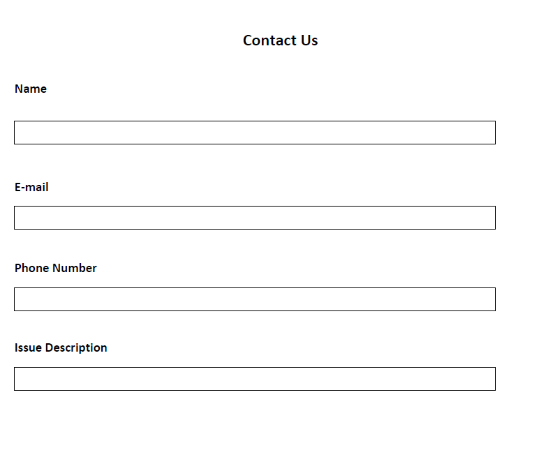

# Integrate adaptive form with database using AEM workflow {#submit-forms-to-database-using-forms-portal}

Automated Forms Conversion service allows you to convert a non-interactive PDF form, an Acro Form, or an XFA based PDF form into an adaptive form. While initiating the conversion process, you have the option of generating an adaptive form either with or without data bindings.

If you select to generate an adaptive form without data bindings, you can integrate the converted adaptive form with a form data model, XML schema, or a JSON schema after conversion. For form data model, you need to bind adaptive form fields manually with the form data model. However, if you generate an adaptive form with data bindings, the conversion service automatically associates the adaptive form(s) with a JSON schema and creates a data binding between the fields available in the adaptive form and JSON schema. You can then integrate the adaptive form with a database of your choice, fill data in the form, and submit it to the database. Similarly, after successful integration with the database, you can configure fields in the converted adaptive form to retrieve values from the database and prefill adaptive form fields.

The following figure depicts different stages of integrating a converted adaptive form with a database:


This article describes the step-by-step instructions to successfully execute all these integration stages.

## Pre-requisites {#pre-requisites}

* Setup an AEM 6.4 or 6.5 author instance 
* Install [latest service pack](https://helpx.adobe.com/experience-manager/aem-releases-updates.html) for your AEM instance
* Latest version of the AEM Forms add-on package
* Configure [Automated Forms Conversion service](configure-service.md)
* Setup a database. The database used in the sample implementation is MySQL 5.6.24. However, you can integrate the converted adaptive form with any database of your choice.

## Sample adaptive form {#sample-adaptive-form}

To execute the use case to integrate converted adaptive forms with database using an AEM workflow, download the following sample PDF file.

You can download the sample Contact Us form using:

[Get File](assets/sample_contact_us_form.pdf)

The PDF file serves as the input to the Automated Forms Conversion service. The service converts this file to an adaptive form. The following image depicts the sample contact us form in a PDF format.



## Install mysql-connector-java-5.1.39-bin.jar file {#install-mysql-connector-java-file}

Perform the following steps, on all the author and publish instances, to install the mysql-connector-java-5.1.39-bin.jar file:

1. Navigate to `http://server:port/system/console/depfinder` and search for com.mysql.jdbc package.
1. In the Exported by column, check if the package is exported by any bundle. Proceed if the package is not exported by any bundle.
1. Navigate to `http://server:port/system/console/bundles` and click **[!UICONTROL Install/Update]**.
1. Click **[!UICONTROL Choose File]** and browse to select the mysql-connector-java-5.1.39-bin.jar file. Also, select **[!UICONTROL Start Bundle]** and **[!UICONTROL Refresh Packages]** checkboxes.
1. Click **[!UICONTROL Install]** or **[!UICONTROL Update]**. Once complete, restart the server.
1. (Windows only) Turn off the system firewall for your operating system.

## Prepare data for form model {#prepare-data-for-form-model}

AEM Forms Data Integration allows you to configure and connect to disparate data sources. After generating an adaptive form using the conversion process, you can define the form model based on a form data model, XSD, or a JSON schema. You can use a database, Microsoft Dynamics, or any other third-party service to create a form data model.

This tutorial uses the MySQL database as the source to create a form data model. Create a schema in the database and add **contactus** table to the schema based on the fields that are available in the adaptive form.


You can use the following DDL statement to create the **contactus** table in database.

```sql
CREATE TABLE `contactus` (
   `name` varchar(45) NOT NULL,
   `email` varchar(45) NOT NULL,
   `phonenumber` varchar(10) DEFAULT NULL,
   `issuedesc` varchar(1000) DEFAULT NULL,
   PRIMARY KEY (`email`)
 ) ENGINE=InnoDB DEFAULT CHARSET=utf8
```

## Configure connection between AEM instance and database {#configure-connection-between-aem-instance-and-database}

Perform the following configuration steps to create a connection between AEM instance and the MYSQL database:

1. Go to AEM Web Console Configuration page at `http://server:port/system/console/configMgr`.
1. Find and click to open **[!UICONTROL Apache Sling Connection Pooled DataSource]** in edit mode in the Web Console Configuration. Specify the values for properties as described in the following table:

    <table> 
    <tbody> 
    <tr> 
    <th><strong>Property</strong></th> 
    <th><strong>Value</strong></th> 
    </tr> 
    <tr> 
    <td><p>Datasource name</p></td> 
    <td><p>A datasource name for filtering drivers from the data source pool.</p></td>
    </tr>
    <tr> 
    <td><p>JDBC driver class</p></td> 
    <td><p>com.mysql.jdbc.Driver</p></td>
    </tr>
    <tr> 
    <td><p>JDBC connection URI</p></td> 
    <td><p>jdbc:mysql://[host]:[port]/[schema_name]</p></td>
    </tr>
    <tr> 
    <td><p>Username</p></td> 
    <td><p>A username to authenticate and perform actions on database tables</p></td>
    </tr>
    <tr> 
    <td><p>Password</p></td> 
    <td><p>Password associated with the username</p></td>
    </tr>
    <tr> 
    <td><p>Transaction Isolation</p></td> 
    <td><p>READ_COMMITTED</p></td>
    </tr>
    <tr> 
    <td><p>Max Active Connections</p></td> 
    <td><p>1000</p></td>
    </tr>
    <tr> 
    <td><p>Max Idle Connections</p></td> 
    <td><p>100</p></td>
    </tr>
    <tr> 
    <td><p>Min Idle Connections</p></td> 
    <td><p>10</p></td>
    </tr>
    <tr> 
    <td><p>Initial Size</p></td> 
    <td><p>10</p></td>
    </tr>
    <tr> 
    <td><p>Max Wait</p></td> 
    <td><p>100000</p></td>
    </tr>
     <tr> 
    <td><p>Test on Borrow</p></td> 
    <td><p>Checked</p></td>
    </tr>
     <tr> 
    <td><p>Test while Idle</p></td> 
    <td><p>Checked</p></td>
    </tr>
     <tr> 
    <td><p>Validation Query</p></td> 
    <td><p>Example values are SELECT 1(mysql), select 1 from dual(oracle), SELECT 1(MS Sql Server) (validationQuery)</p></td>
    </tr>
     <tr> 
    <td><p>Validation Query timeout</p></td> 
    <td><p>10000</p></td>
    </tr>
    </tbody> 
    </table>

## Create form data model {#create-form-data-model}

Once you configure MYSQL as the data source, execute the following steps to create a form data model:

1. In AEM author instance, navigate to **[!UICONTROL Forms]** &gt; **[!UICONTROL Data Integrations]**.

1. Tap **[!UICONTROL Create]** &gt; **[!UICONTROL Form Data Model]**.

1. In the **[!UICONTROL Create Form Data Model]** wizard, specify **workflow_submit** as the name for the form data model. Tap **[!UICONTROL Next]**.

1. Select the MYSQL data source that you have configured in the previous section and tap **[!UICONTROL Create]**.

1. Tap **[!UICONTROL Edit]** and expand the data source listed in the left pane to select **contactus** table, **[!UICONTROL get]**, and **[!UICONTROL insert]** services, and tap **[!UICONTROL Add Selected]**.

   

1. Select the data model object in the right pane and tap **[!UICONTROL Edit Properties]**. Select **[!UICONTROL get]** and **[!UICONTROL insert]** from **[!UICONTROL Read Service]** and **[!UICONTROL Write Service]** drop-down lists. Specify the arguments for the Read service and tap **[!UICONTROL Done]**.

1. In the **[!UICONTROL Services]** tab, select the **[!UICONTROL get]** service and tap **[!UICONTROL Edit Properties]**. Select the **[!UICONTROL Output Model Object]**, disable the **[!UICONTROL Return array]** toggle, and tap **[!UICONTROL Done]**.

1. Select the **[!UICONTROL Insert]** service and tap **[!UICONTROL Edit Properties]**. Select the **[!UICONTROL Input Model Object]** and tap **[!UICONTROL Done]**.

1. Tap **[!UICONTROL Save]** to save the form data model.

You can download the sample Form Data Model using:

[Get File](assets/DownloadedFormsPackage_1497728018502500.zip)

## Generate adaptive forms with JSON binding {#generate-adaptive-forms-with-json-binding}

Use the [Automated Forms Conversion service to convert](convert-existing-forms-to-adaptive-forms.md) the [Contact Us form](#sample-adaptive-form) to an adaptive form with data binding. Ensure that you do not select the **[!UICONTROL Generate adaptive form(s) without data bindings]** check box while generating the adaptive form.


Select the converted **Contact Us form** available in the **[!UICONTROL output]** folder in **[!UICONTROL Forms & Documents]** and tap **[!UICONTROL Edit]**. Tap **[!UICONTROL Preview]**, enter values in the adaptive form fields and tap **[!UICONTROL Submit]**.

Log on to **crx-repository** and navigate to */content/forms/fp/admin/submit/data* to view the submitted values in JSON format. The following is the sample data in JSON format when you submit the converted **Contact Us** adaptive form:

```json
{
  "afData": {
    "afUnboundData": {
      "data": {}
    },
    "afBoundData": {
      "data": {
        "name1": "Gloria",
        "email": "abc@xyz.com",
        "phone_number": "2346578965",
        "issue_description": "Test message"
      }
    },
    "afSubmissionInfo": {
      "computedMetaInfo": {},
      "stateOverrides": {},
      "signers": {},
      "afPath": "/content/dam/formsanddocuments/docs_conversion/output/sample_form_json",
      "afSubmissionTime": "20191204014007"
    }
  }
}
```

You need to create a workflow model now that can process this data and submit it to the MYSQL database using the form data model that you have created in the previous sections.

## Create a workflow model to process JSON data {#create-workflow-model}

Execute the following steps to create a workflow model to submit the adaptive form data to the database:

1. Open the Workflow Models console. The default URL is `https://server:port/libs/cq/workflow/admin/console/content/models.html/etc/workflow/models`.

1. Select **[!UICONTROL Create]**, then **[!UICONTROL Create Model]**. The **[!UICONTROL Add Workflow Model]** dialog appears.

1. Enter the **[!UICONTROL Title]** and **[!UICONTROL Name]** (optional). For example, **workflow_json_submit**. Tap **[!UICONTROL Done]** to create the model.

1. Select the workflow model and tap **[!UICONTROL Edit]** to open the model in edit mode. Tap + and add **[!UICONTROL Invoke Form Data Model Service]** step to the workflow model.

1. Tap the **[!UICONTROL Invoke Form Data Model Service]** step and tap .

1. In the **[!UICONTROL Form Data Model]** tab, select the form data model that you have created in the **[!UICONTROL Form Data Model path]** field and select **[!UICONTROL insert]** from the **[!UICONTROL Service]** drop-down list.

1. In the **[!UICONTROL Input for Service]** tab, select **[!UICONTROL Provide input data using literal, variable, or a workflow metadata, and a JSON file]** from the drop-down list, select **[!UICONTROL Map input fields from input JSON]** checkbox, select **[!UICONTROL Relative to payload]**, and provide **data.xml** as the value for the **[!UICONTROL Select input JSON document using]** field.

1. In the **[!UICONTROL Service Arguments]** section, provide the following values for the form data model arguments:

   

   Notice that the form data model fields, for example, contactus dot name, is mapped to **afData.afBoundData.data.name1**, which refers to the JSON schema bindings for the submitted adaptive form.

## Configure adaptive form submission {#configure-adaptive-form-submission}

Execute the following steps to submit the adaptive form to the workflow model that you have created in the previous section:

1. Select the converted Contact Us form available in the **[!UICONTROL output]** folder in **[!UICONTROL Forms & Documents]** and tap **[!UICONTROL Edit]**.

1. Open adaptive form properties by tapping **[!UICONTROL Form Container]** and then tapping .

1. In the **[!UICONTROL Submission]** section, select **[!UICONTROL Invoke an AEM workflow]** from the **[!UICONTROL Submit Action]** drop-down list, select the workflow model that you created in the previous section, and specify **data.xml** in the **[!UICONTROL Data File Path]** field.

1. Tap  to save the properties.

1. Tap **[!UICONTROL Preview]**, enter values in the adaptive form fields and tap **[!UICONTROL Submit]**. The submitted values now display in the MYSQL database table instead of **crx-repository**.

## Configure adaptive form to prefill values from database

Execute the following steps to configure adaptive form to prefill values from the MYSQL database based on the primary key defined in the table (E-mail in this case):

1. Tap the **E-mail** field in the adaptive form and tap .

1. Tap **[!UICONTROL Create]** and select **[!UICONTROL is changed]** from the **[!UICONTROL Select State]** drop-down list in the **[!UICONTROL When]** section.

1. In the **[!UICONTROL Then]** section, select **[!UICONTROL Invoke Service]** and **get** as the service for the form data model that you have created in a previous section of this article.

1. Select **E-mail** in the **[!UICONTROL Input]** section and the rest three fields of the form data model, **Name**, **Phone Number**, and **Issue Description** in the **[!UICONTROL Output]** section. Tap **[!UICONTROL Done]** to save the settings.

   

   As a result, based on existing E-mail entries in the MYSQL database, you can prefill the values for the rest three fields in the **[!UICONTROL Preview]** mode of the adaptive form. For example, if you specify aya.tan@xyz.com in the **E-mail** field (based on existing data in [Prepare form data model](#prepare-data-for-form-model) section of this article) and tab out of the field, the rest three fields, **Name**, **Phone Number**, and **Issue Description** display automatically in the adaptive form.

You can download the sample converted adaptive form using:

[Get File](assets/DownloadedFormsPackage_1498226829041200.zip)
