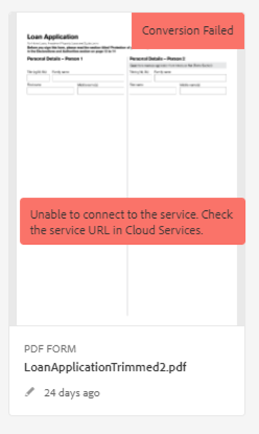

# Troubleshoot Automated Forms Conversion Service

The article provides information on installation, configuration and administration issues that may arise in an Automated Forms Conversion Service production environment. The document also provides basic troubleshooting steps and explanation for common error messages. 

## Common errors {#commonerrors}

|Error|Example|
|--- |--- |
|**Error Message**   The access token header is not available.   **Reason**   An administrator has created multiple IMS configurations or IMS configuration is not able to reach AFCS service on Adobe Cloud.   **Resolution**   If there are multiple configurations, delete all the configurations and [create a new configuration](configure-service.md#obtainpubliccertificates).   If there is single configuration, use **[!UICONTROL Health Check]** to [check connectivity](configure-service.md#createintegrationoption).||
|**Error Message**   Unable to connect to the service.    **Reason**   Incorrect service URL or no service URL is mentioned in Automated Forms Conversion Service cloud services.   **Resolution**   Correct [Service URL](configure-service.md#configure-the-cloud-service) in Automated Forms Conversion Service Cloud services.||
