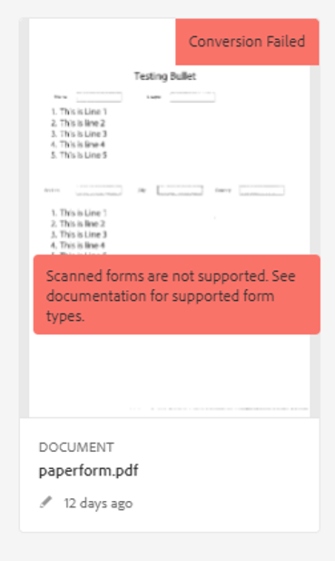

# Troubleshoot Automated Forms Conversion Service

The article provides information on installation, configuration and administration issues that may arise in an Automated Forms Conversion Service production environment. The document also provides basic troubleshooting steps and explanation for common error messages. 

## Common errors {#commonerrors}

|Error|Example|
|--- |--- |
|**Error Message**   The access token header is not available.   **Reason**   An administrator has created multiple IMS configurations or IMS configuration is not able to reach AFCS service on Adobe Cloud.   **Resolution**   If there are multiple configurations, delete all the configurations and [create a new configuration](configure-service.md#obtainpubliccertificates).   If there is single configuration, use **[!UICONTROL Health Check]** to [check connectivity](configure-service.md#createintegrationoption).||
|**Error Message**   Unable to connect to the service.    **Reason**   Incorrect service URL or no service URL is mentioned in Automated Forms Conversion Service cloud services.   **Resolution**   Correct [Service URL](configure-service.md#configure-the-cloud-service) in Automated Forms Conversion Service Cloud services.||
|**Error Message**   The service failed to convert the form.    **Reason**   Network connectivity issues at your end or  the service is down due to scheduled maintenance or outage on Adobe Cloud.   **Resolution**   Resolve network connectivity issues at your end and check the status of the service on https://status.adobe.com/ for planned or unplanned outage.||
|**Error Message**   The number of pages are more than 15.    **Reason**   The folder containing source XDP and PDF forms has more than 15 files.   **Resolution**   Bring the number of forms in a folder to less than or equal to 15. Bring the total number of pages in a folder less than 50. Bring the size of the folder to less than 10 MB. Do not keep forms in a sub-folder. Organize source documents into a batch of 8-15 documents. ||
|**Error Message**   The source file format is not supported.    **Reason**   The folder containing source forms have some unsupported files.   **Resolution**   The service supports only .xdp and .pdf files. Remove files with any other extension from the folder and run the conversion. ||
|**Error Message**   Scanned forms are not supported.    **Reason**   The PDF form contains only scanned image of the form and contains no content structure.   **Resolution**   The service does not support converting scanned forms or an image of a form to an adaptive out-of-the-box. However, you use Adobe Acrobat to convert the image of a form to a PDF Form. Then, use the service to convert the PDF Form to an adaptive form. Always use a high-quality image of the form for conversion in Acrobat. It improves the quality of the conversion. ||