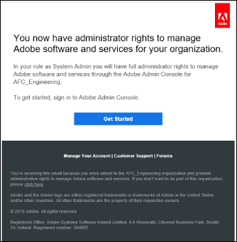
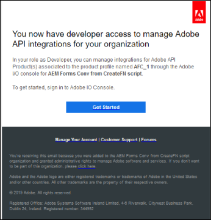
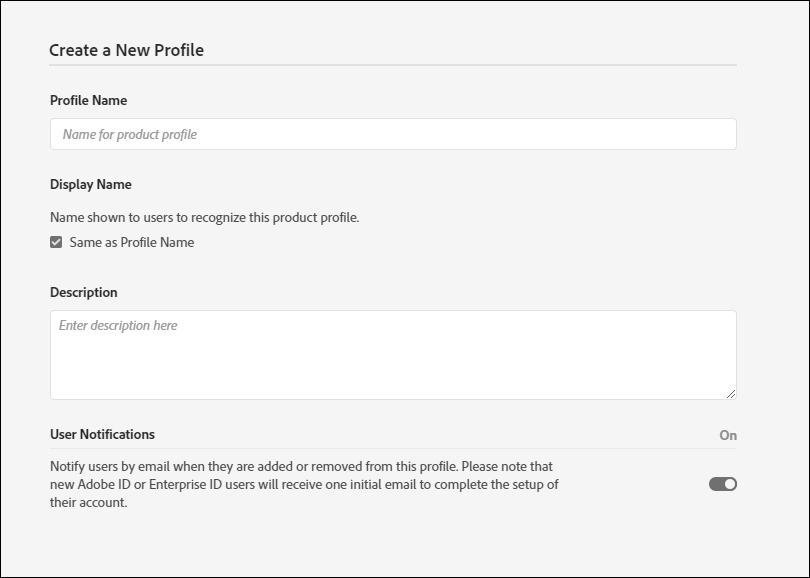
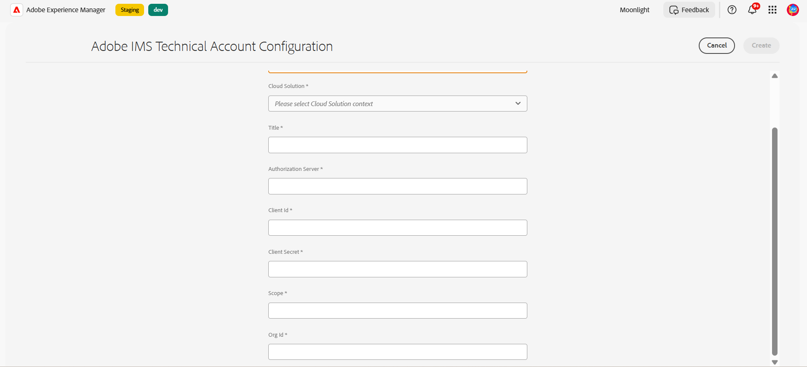

# Configure the Automated Forms Conversion service (AFCS) {#about-this-help}

This article describes how an AEM administrator can configure Automated Forms Conversion service (AFCS) to automate conversion of their PDF forms to Adaptive Forms. This article is for IT and AEM administrators at your organization. The information provided is based on the assumption that anyone reading this article is familiar with the following technologies:

* Installing, configuring, and administering Adobe Experience Manager and AEM packages,

* Using Linux&reg; and Microsoft&reg; Windows&reg; operating systems,

<!--- >[!VIDEO](https://video.tv.adobe.com/v/29267/) 

**Watch the video or read the article to configure Automated Forms Conversion service (AFCS)** -->

## Onboarding{#onboarding}

The service is available for free to AEM 6.5 Forms On-Premise term customers and Adobe-Managed Service enterprise customers. You can contact Adobe Sales team or your Adobe representative to request access to the service. The service is also available for free and pre-enabled for AEM Forms as a Cloud Service customers.

Adobe enables access for your organization and provide required privileges to the person designated as administrator in your organization. The administrator can grant access to your AEM Forms developers (users) of your organization to connect to the service. 

## Prerequisites {#prerequisites}

You require the following to use the Automated Forms Conversion Service (AFCS):

* Automated Forms Conversion service (AFCS) is enabled for your organization
* An Adobe ID account with administrator privileges for the conversion service
* An up and running AEM 6.5 with the latest AEM Service Pack or AEM Forms as a Cloud Service author instance with the latest updates.
* An AEM user (on your AEM instance) which is member of forms-user group

## Set up the environment {#setuptheservice}

Before using the service, prepare your AEM author instance to connect to the service running on Adobe Cloud. Perform the following steps in the listed sequence to prepare your instance for the service:

1. [Download and install AEM 6.5, or onboard AEM Forms as a Cloud Service](#aemquickstart)
1. [(For AEM 6.5 only) Download and install latest AEM Service Pack](#servicepack)
1. [(For AEM 6.5 only) Download and install latest AEM Forms add-on package](#downloadaemformsaddon)
1. [Create custom themes and templates](#referencepackage)

### 1. Download and install AEM 6.5 or onboard AEM Forms as a Cloud Service {#aemquickstart}


Automated Forms Conversion service (AFCS) runs on AEM author instance. You require AEM 6.5 or AEM Forms as a Cloud Service to set up an AEM author instance. 

* If you do not have AEM 6.5 up and running, download it from the below locations. After you download AEM, for instructions to set up an AEM author instance, see [deploying and maintaining](https://helpx.adobe.com/experience-manager/6-5/sites/deploying/using/deploy.html#defaultlocalinstall).:

  * If you are an existing AEM customer, download AEM 6.5 from [Adobe Licensing website](http://licensing.adobe.com).

  * If you are an Adobe partner, use [Adobe Partner Training Program](https://adobe.allegiancetech.com/cgi-bin/qwebcorporate.dll?idx=82357Q) to request AEM 6.5.

* If you are using AEM Forms as a Cloud Service, see onboard to [AEM Forms as a Cloud Service](https://experienceleague.adobe.com/docs/experience-manager-forms-cloud-service/forms/setup-environment/setup-forms-cloud-service.html?lang=en#setup-environment) and [setup a local development environment](https://experienceleague.adobe.com/docs/experience-manager-forms-cloud-service/forms/setup-environment/setup-local-development-environment.html?lang=en#setup-environment).

### 2. (For AEM 6.5 only) Download and install AEM the latest Service Pack {#servicepack}

Download and install the latest AEM Service Pack. For detailed instructions see [AEM 6.5 Service Pack Release Notes](https://experienceleague.adobe.com/en/docs/experience-manager-65/content/release-notes/release-notes).

### 3. (For AEM 6.5 only) Download and install AEM Forms add-on package  {#downloadaemformsaddon}

An AEM instance contains basic forms capabilities. The conversion service requires full capabilities of AEM Forms. Download and install AEM Forms add-on package to avail all the capabilities of AEM Forms. The package is required to set up and run the conversion service. For detailed instructions, see [Install and configure data capture capabilities.](https://experienceleague.adobe.com/en/docs/experience-manager-65/content/forms/install-aem-forms/osgi-installation/installing-configuring-aem-forms-osgi)
https://adminconsole.adobe.com/
>[!NOTE]
> Ensure that you perform the mandatory post-installation configurations after installing the add-on package.
>

<!-- ### (Optional) Download and install connector package  {#installConnectorPackage}

The connector package provides early access to the [Auto-detect logical sections](convert-existing-forms-to-adaptive-forms.md#run-the-conversion) features and improvements delivered in release AFC-2020.03.1. Do not install the package if you do not require feature and improvements delivered in AFC-2020.03.1.  You can [download the connector package from AEM Package Share](https://www.adobeaemcloud.com/content/marketplace/marketplaceProxy.html?packagePath=/content/companies/public/adobe/packages/cq650/featurepack/AFCS-Connector-2020.03.1). -->


### 4. Create custom themes and templates {#referencepackage}

The reference packages contain sample themes and templates. Automated Forms Conversion service (AFCS) requires at least one theme and one template to convert a PDF form to an adaptive form. Create a custom theme and template of your own and point [service configuration](#configure-the-cloud-service) to use custom templates and themes before using the service.

You can also download and install the [AEM Forms Reference Assets](https://experience.adobe.com/#/downloads/content/software-distribution/en/aemcloud.html) package on your Author instance. It creates some reference themes and template. 

## Configure Access and Permissions 

Before you proceed to configure the service and connect your instance with the service running on Adobe Cloud, learn about the personas and privileges required to connect to the service. The service uses two different types of personas, administrators and developers:

* **Administrators**: Administrators are responsible for managing Adobe software and services for their organization. Administrators grant access to developers in their organization to connect to Automated Forms Conversion service (AFCS) running on Adobe Cloud. When an administrator is provisioned for an organization, the administrator receives an email with title **[!UICONTROL 'You now have administrator rights to manage Adobe software and services for your organization']**. If you are an administrator, check your mailbox for email with previously mentioned title and proceed to [grant access to developers of your organization](#adduseranddevs).



* **Developers**: A developer connects an AEM Forms author instance to Automated Forms Conversion service (AFCS) running on Adobe Cloud. When an administrator grants rights to a developer to connect to Automated Forms Conversion service (AFCS), an email with title You now have developer access to manage Adobe API integrations for your organization is sent to the developer. If you are a developer, check your mailbox for email with previously mentioned title and proceed to [Connect your local AEM instance to Automated Forms Conversion service on Adobe Cloud.](#connectafcadobeio)  
  
  

### Grant access to developers of your organization 

After Adobe enables access for your organization and provides required privileges to the administrator, the administrator can log into Admin Console (detailed instructions below), create a profile, and add developers to the profile. Developers can connect an instance of AEM Forms to Automated Forms Conversion service (AFCS) on Adobe Cloud.

Developers are members of your organization designated to run the conversion service. Only those developers which are added to Adobe Automated Forms Conversion service (AFCS) profile are entitled to use the Automated Forms Conversion service (AFCS). 
Perform the below steps to create a profile and add developers to it. A minimum of one profile is required to grant required access to developers of your organization:

1. Log in to [Admin Console](https://adminconsole.adobe.com/). Use **Adobe ID** of administrator provisioned to use Automated Forms Conversion service (AFCS) to login.
1. Click the **[!UICONTROL Automated Forms Conversion]** option.
1. Click **[!UICONTROL New Profile]** in the **[!UICONTROL Products]** tab.
1. Specify **[!UICONTROL Name]**, **[!UICONTROL Display Name]**, and **[!UICONTROL Description]** for the profile. Click **[!UICONTROL Done]**. For example, create a profile as **AFC_Flamingo_Test_Dev**.

    

1. Add developer to the profile. To add the developers:
   1. In the [Admin Console](https://adminconsole.adobe.com/enterprise), navigate to the Overview tab.
   1. Click **[!UICONTROL Assign Developers]** on the required product card.
   1. Enter the developers email address and, optionally, first and last names.
   1. Select product profiles. Click  **[!UICONTROL Save]**.

Repeat above steps for all the users. For more details about adding developers, see [Manage developers](https://helpx.adobe.com/enterprise/using/manage-developers.html).

Once an administrator adds developers to Adobe I/O profile, the developers are notified via email (if configured). 

<!--
### Configure email notification for local AEM Forms instance

Automated Forms Conversion service (AFCS) uses the Day CQ mail service to send email notifications. These email notifications contain information about successful or failed conversions. If you choose not receive notification, skip these steps. Perform the following steps to configure the Day CQ Mail Service:

* **For AEM 6.5 Forms**:

   1. Go to AEM configuration manager at `http://[server]:[port]/system/console/configMgr`
   2. Open the Day CQ Mail Service configuration. Specify a value for the **[!UICONTROL SMTP server host name]**, **[!UICONTROL SMTP server port]**, and **[!UICONTROL From address]** fields. Click **[!UICONTROL Save]**.

      You can contact your email service provider or IT administrator for information about host name and port of SMTP server. You can use any valid email address in the from field. For example, notification@example.com or donotreply@example.com.

   3. Open the **[!UICONTROL Day CQ Link Externalizer]** configuration. In the **[!UICONTROL Domains]** field, specify the actual host name or IP address and port number for local, author, and publish instances. Click **[!UICONTROL Save]**.

* For AEM Forms as a Cloud Service, [log a support ticket to enable the email service](https://experienceleague.adobe.com/docs/experience-manager-cloud-service/implementing/developing/development-guidelines.html?lang=en#sending-email). -->

### Add user to the forms-users group {#adduserstousergroup}

Specify an email address in the profile of the AEM user designated to run the service. Ensure that the user is the member of the **forms-users** group. Emails are sent to the email address of user running the conversion. To specify an email address for the user and add user to the forms user group:

1. Log in to your AEM Forms author instance as an AEM administrator. Use your local AEM credentials to login. 
1. Click **[!UICONTROL Adobe Experience Manager]** > **[!UICONTROL Tools]** > **[!UICONTROL Security]** > **[!UICONTROL Users]**.
1. Select a user designated to run the conversion service and click **[!UICONTROL Properties]**. The **Edit User Settings** page opens.
1. Specify an email address in the **[!UICONTROL Email]** field and click **[!UICONTROL Save]**. The emails are sent to specified email address on successful completion or failure of the conversion.

   
1. Click the **Groups** tab. In the select group tab, type and select the **forms-users** group. 
1. Click **Save & Close**. The user is now a member of the forms-users group.

   

## Connect your AEM Forms instance to Automated Forms Conversion service (AFCS) on Adobe Cloud

After an administrator provides you developer access, you can connect your AEM Forms instance to Automated Forms conversion service (AFCS) running on Adobe Cloud. 
Perform the following steps, to connect AEM Forms instance to Automated Forms Conversion service:

[1. Configure the service APIs on Adobe Developer Console](#configure-the-service-apis-on-adobe-developer-console)

[2. Create Adobe IMS configurations](#2-create-adobe-ims-configurations)

[3. Create Automated Forms Conversion Configuration](#3-create-automated-forms-conversion-configuration)

### 1. Configure the service APIs on Adobe Developer Console

To use Automated Forms Conversion service (AFCS), create a project and add **Automated Forms Configuration Service** API to the project on Adobe Developer Console. The integration generates API Key, Client Secret, Technical Account ID, Scopes and Organization ID. 
To configure the Automated Forms Conversion service API on Adobe Developer Console, perform the followin steps:

1. Log in to https://developer.adobe.com/console . Use your Adobe ID, developer account that your administrator has provisioned to login to Adobe I/O console to login.
1. Select your organization from the top-right corner. If you do not know your organization, contact your administrator.
1. Click **[!UICONTROL Create new project]**. A screen to get started with your new project appears. 

   

1. Click **[!UICONTROL Add API]**. A screen with list of all the APIs enabled for your account appears.
    

1. Select **[!UICONTROL Automated Forms Conversion service]** and click **[!UICONTROL Next]**. A screen to configure the API appears.
    
   
1. Select **OAuth Server-to-Server** authentication method.
1. Specify the **[!UICONTROL Credential Name]** and click **[!UICONTROL Next]**.
    
1. Select a **Product Profile**. For example, select a profile as **AFC_Flamingo_Test_Dev**. 
1. Click **[!UICONTROL Save configured API]**. 
    
   
   >[!NOTE]
   >
   > Select the profile created while granting access to developers of your organization. If you do not know the profile to select, contact your administrator.

1. Click **[!UICONTROL OAuth Server-to-Server]** to view the API Key, Client Secret, and other information required to connect your AEM instance to Automated Forms Conversion service (AFCS). 
    
   
      The information on the page is used to create IMS configuration, as explained in the [Create IMS Technical Configuration on AEM Author Instance](#2-create-ims-technical-configuration-on-aem-author-instance) section.

      

### 2. Create Adobe IMS configurations

Log in to your author instance to create the Adobe IMS configurations. Use the **OAuth Credentials Details** to retrieve the API Key, Client Secret, Technical Account ID, Scopes, and Organization ID.

1. Log in to your AEM Forms author instance. Navigate to **[!UICONTROL Tools]**> **[!UICONTROL Security]** > **[!UICONTROL Adobe IMS Configurations]**. 
1. Click **[!UICONTROL Create]**. 
   
   
   
1. The **[!UICONTROL Adobe IMS Technical Account Configuration]** page appears.

   
1. Select **[!UICONTROL Automated Forms Conversion Service]** in **Cloud Solution**.  
1. Specify the below:

    * **Title**: Specify a title.  
    * **Authorization Server**: [https://ims-na1.adobelogin.com](https://ims-na1.adobelogin.com)
    * Retrieve the following from the [Configure the service APIs on Adobe Developer Console](#1-configure-the-service-apis-on-adobe-developer-console) section:
      * **Client Id**: Copy and paste **API Key(Client ID)**.
      * **Client Secret**: Copy and paste **Client Secret**.
      * **Scope**: Copy and paste **Scopes**. 
      * **Org ID**: Copy and paste **Technical Account ID**.

      

1. Click **[!UICONTROL Save]**. The Adobe IMS configuration is created.

   >[!CAUTION]
   >
   > Create only one IMS configuration. Do not create more than one IMS configurations.

1. Select the **Adobe IMS configuration** and click **[!UICONTROL Check Health]**. A dialog box appears. 
   

   A **Check** dialog box appears. 

1. Click **[!UICONTROL Check]**. 
   
    
   
   On successful connection, the *Token retrieved successfully* message appears.

   

1. Click **Close**.

### 3. Create Automated Forms Conversion Configuration 

Create an Automated Forms Conversion  configuration to connect your AEM instance to the conversion service. It also allows you to specify a template, theme, and form fragments for a conversion. You can create multiple cloud service configurations separate for each set of forms. 
For example, you can have a separate configuration for sales department forms and a separate one for customer support forms. Perform the following steps to create a cloud service configuration:

1. On your AEM Forms instance, click **[!UICONTROL Adobe Experience Manager]** > **[!UICONTROL Tools]**> **[!UICONTROL Cloud Services]** > **[!UICONTROL Automate Forms Conversion Configuration]**.
1. Select the **[!UICONTROL Global]** folder and click **[!UICONTROL Create]**. 
   The page to **Create Automated Forms Conversion Configuration** appears. The configuration is created in the **Global** folder. You can also create the configuration in a different folder that exists or create a folder for your configurations.
   
1. On the **[!UICONTROL Create Automated Forms Conversion Configuration]** page, specify value for the following fields and click **[!UICONTROL Next]**.

   

   |Field|Description|
   |--- |--- |
   |Title|Unique title for the configuration. The title is displayed in the UI used to start conversion.|
   |Name|Unique name for the configuration. The configuration is saved in the CRX-Repository with the specified name. The name can be identical to the title.|
   |Thumbnail location|Location of the thumbnail for the configuration.|
   |Service URL|URL of the Automated Forms Conversion service (AFCS) on Adobe Cloud. Use the `https://aemformsconversion.adobe.io/` URL.|
   |Template|Default template to be applied to converted forms. You can always specify a different template before starting the conversion. A template contains basic structure and initial content for an adaptive form. You can choose a template from the templates provided out-of-the-box. You can also create a custom template.|
   |Theme|Default theme to be applied to converted forms. You can always specify a different theme before starting the conversion.  You can click the icon to choose a theme provided out-of the box. You can also create a custom theme.|
   |Existing Fragments|Location of existing fragments, if any.|
   |Custom Meta-model|Path of the .schema.json file of custom meta-model. You can create separate meta-models for English, French, German, Spanish, Italian, and Portuguese languages.|

1. In the **[!UICONTROL Advanced]** tab of the **[!UICONTROL Create Automated Forms Conversion Configuration]** page, specify value for the following field:
   

   <table>
   <thead>
   <tr>
   <th>Field</th>
   <th>Description</th>
   </tr>
   </thead>
   <tbody>
   <tr>
   <td >Generate Document of Record</td>
   <td>Select the option to automatically generate Document of Record for converted forms. The option is only for XFA-based forms (XDP and PDF Forms). When you enable the option, after submitting a form, you can allow your customers to keep a record, in print or in document format, of the information they have filled in the form for their future reference. This is referred to as a document of record.</td>
   </tr>
   <tr>
   <td>Enable Analytics</td>
   <td>(For AEM 6.5) Select the option to enable Adobe Analytics on all the converted forms. Before using the option, ensure that Adobe Analytics is enabled for your AEM Forms instance.</td>
   </tr>
   </tbody>
   </table>

   * When the source is an XFA-based form with extension .XDP, then the output DOR retains the XFA layout, else the conversion service uses an out-of-the-box template to generate DOR for other XFA-based forms.
   * When an XFA form is submitted, submit data of the form is saved as an XML element or an attribute. For example, `<Amount currency="USD"> 10.00 </Amount>`. The currency is saved as an attribute and currency amount, 10.00 is saved as an element. Submit data of an adaptive form does not have attributes, it has only elements. So, when an XFA-based form is converted to adaptive form, the adaptive form submit data contains an element for each such attribute. For example,

   ```css
      {
         "Type": "Principal",

         "Amount": "10.00",

         "currency": "USD"
      }
   ```

1. Click **[!UICONTROL Create]**. The cloud configuration is created. Your AEM Forms instance is ready to start converting legacy forms to Adaptive Forms.
