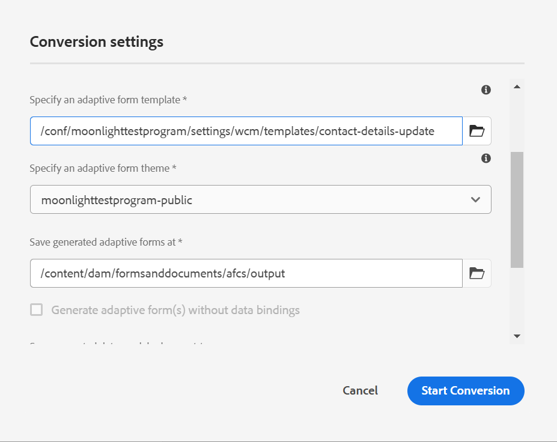

# Convert PDF forms to adaptive forms {#convert-print-forms-to-adaptive-forms}

AEM Forms Automated Forms Conversion service (AFCS), powered by Adobe Sensei, automatically converts your PDF forms to device-friendly and responsive adaptive forms. Whether you are using non-interactive PDF forms, Acro Forms, or XFA-based PDF forms, the Automated Forms Conversion service (AFCS) can easily convert these forms into adaptive forms. For information about the capabilities, conversion workflow, and onboarding information see [Automated Forms Conversion](introduction.md) service.

## Pre-requisites {#pre-requisites}

* [**Configure the conversion service**](configure-service.md)  

* **Prepare the [templates](https://helpx.adobe.com/experience-manager/6-5/forms/using/template-editor.html) to be applied to converted forms:** Using a template allows you to apply consistent branding across all the adaptive forms. Moreover, Automated Forms Conversion service (AFCS) does not extract and use header and footer of source PDF documents. You can use adaptive form templates to specify header and footer. Header and footer specified in the template are applied to the adaptive form during conversion. When you create a folder for the templates, select the **[!UICONTROL Browse configurations]** option for everyone.

* **Prepare the [themes](https://helpx.adobe.com/experience-manager/6-5/forms/using/themes.html) to be applied to converted forms:** Using a theme allows you to apply a consistent style to all the adaptive forms of your organization.

* **(optional)** [**Convert your source PDF Forms to Adobe Sign form**](frequently-asked-questions.md)

## Start the conversion process {#start-the-conversion-process}

After you connect your AEM instance with AEM Forms Conversion Service, you can convert your PDF forms to adaptive forms. Perform the following steps in the listed order to convert the forms:

* [Upload PDF forms to your AEM Forms server](convert-existing-forms-to-adaptive-forms.md#upload-pdf-forms-to-your-aem-forms-server)
* [Run the conversion](convert-existing-forms-to-adaptive-forms.md#run-the-conversion)
* [Review and correct the converted forms](review-correct-ui-edited.md)

### Upload PDF forms to your AEM Forms server {#upload-pdf-forms-to-your-aem-forms-server}

The conversion service converts PDF forms available on your AEM Forms instance to adaptive forms. You can upload all the PDF forms at once or in a phased manner, as required. Before uploading the forms, consider the following:

* Keep the number of forms in a folder less than 15 and keep the total number of pages in a folder less than 50.  
* Keep the size of folder less than 10 MB. Do not keep forms in a subfolder.
* Keep the number of pages in a form less than 15.  
* Do not upload the protected forms. The service does not convert password-protected and secured forms.
* Do not upload source forms with spaces in the filename. Remove the space from the name of the file before uploading the forms.
* Do not upload [PDF Portfolios](https://helpx.adobe.com/acrobat/using/overview-pdf-portfolios.html). The service does not convert a PDF Portfolio to an adaptive form.
* Read the [Known issues](known-issues.md) and the [Best practices and considerations](styles-and-pattern-considerations-and-best-practices.md) sections and make suggested changes to forms.

Perform the following steps to upload the forms to be converted to a folder on your AEM Forms instance:

1. Log in to the AEM Forms instance.
1. Tap **[!UICONTROL Adobe Experience Manager]**  > **[!UICONTROL Navigation]**  > **[!UICONTROL Forms]** > **[!UICONTROL Forms & Documents]**.
1. Tap **[!UICONTROL Create]**> **[!UICONTROL Folder]**. Specify **Title** and **Name** of the folder. Tap **[!UICONTROL Create]**. A folder is created.
1. Tap to open the newly created folder.
1. Tap **[!UICONTROL Create]**> **[!UICONTROL File Upload]**. Select the forms to upload, click **[!UICONTROL Open]**, and click **[!UICONTROL Upload]**. The forms are uploaded.

### Run the conversion {#run-the-conversion}

After you have uploaded the forms and configured the service, perform the following steps to start the conversion:

1. On your AEM Forms instance, tap **[!UICONTROL Adobe Experience Manager]**  > **[!UICONTROL Navigation]**  > **[!UICONTROL Forms]** > **[!UICONTROL Forms & Documents]**.
1. Select a form or the folder containing PDF forms (forms to be converted) and tap **[!UICONTROL Start Automated Conversion]**. The **[!UICONTROL Conversion Settings]** dialog appears.

   

   #### Convert PDFs to Adaptive Form Core Components(#convert-pdf-to-afcc)

     This feature is under the Early Adopter Program. You can write to aem-forms-ea@adobe.com from your official email id to join the early adopter program and request access to the capability. 
    
    Above converted form is the foundation based forms, you can also create core components based adaptive form. For converting a PDF form to a Core Components based adaptive form: 

    1. Ensure you have enabled [Core Components](https://experienceleague.adobe.com/en/docs/experience-manager-core-components/using/adaptive-forms/introduction) on your AEM Forms instance. If it is not enabled, you can [enable core components on your AEM 6.5](https://experienceleague.adobe.com/en/docs/experience-manager-65/content/forms/adaptive-forms-core-components/enable-adaptive-forms-core-components) or [Cloud Service environment](https://experienceleague.adobe.com/en/docs/experience-manager-cloud-service/content/forms/setup-configure-migrate/enable-adaptive-forms-core-components).
    1. Select a [core components based adaptive form template and theme](https://experienceleague.adobe.com/en/docs/experience-manager-core-components/using/adaptive-forms/sample-themes-templates-form-data-models-core-components) as shown in the image below:
    .
    1. Tap **[!UICONTROL Start Conversion]** to convert the PDF to a core components based form.
    >[!NOTE]
    > * Properties such as data binding or data model schema are not available for core component based adaptive form but the same are available for foundation components as described in the next points.
    > * [Review and correct the converted forms](#review-and-correct-the-converted-forms) is not available for core components based form.

1. In the **[!UICONTROL Basic]** tab of the Conversion Settings dialog:

    * **[!UICONTROL Select a cloud configuration]**. When you select a configuration, default template and theme are already specified. You can specify a different template or a theme, if required.  
    * Specify a location to save generated adaptive forms and corresponding schema. You can use default paths or specify custom paths.  
    * Use the **Generate adaptive forms without data model bindings** option to select if you want to generate an adaptive form with or without data model bindings.
    If you do not select this option, the conversion service automatically associates the adaptive forms with a JSON schema and creates a data binding between the fields available in the adaptive form and JSON schema. The **[!UICONTROL Save generated data model schema at]** field displays the default location to save the generated JSON schema. You can also customize the location to save the generated schema.
    If you select this option, the conversion service generates an adaptive form without data model bindings. After a successful conversion, you can associate an adaptive form with a Form Data Model, XML schema, or a JSON schema. For more information, see [Creating an adaptive form](https://helpx.adobe.com/experience-manager/6-5/forms/using/creating-adaptive-form.html).

   <!--

   Comment Type: draft

   <note type="note">
   
The XDP or XFA-based PDF form is not used to generate the Document of Record. The conversion service auto-generates the Document of Record only if you enable the Tools &gt; Cloud Services &gt; Automated Forms Conversion Configuration &gt; <strong>&lt;Properties of selected configuration&gt; &gt;</strong> Advanced &gt; Generate Document of Record option.

   
 

   </note>
   -->

1. In the **[!UICONTROL Additional]** tab of Conversion Settings dialog,
    * Select the **[!UICONTROL Extract fragment from adaptive forms]** option to allow the conversion service to identify, extract, and download form fragments for converted forms. When you select the **[!UICONTROL Extract fragment from adaptive forms]** option, the options to specify paths for saving extracted form fragments and corresponding form fragments schemas is enabled.  
    * Specify the location of **[!UICONTROL existing adaptive form fragments]**, if you have some existing JSON schema based and schema less adaptive form fragments and you plan to use these fragments in automatically generated adaptive forms. Conversion service matches available JSON schema based and schema less adaptive form fragments with input PDF Forms (non-interactive PDF Forms only), if there is a match, the matched adaptive form fragment is used in corresponding adaptive forms.

   >[!NOTE]
   >
   >
   > * You can use only **[!UICONTROL  Extract Fragment]** or **[!UICONTROL Use existing adaptive form fragments]** option at a time. You cannot use both the options simultaneously.
   > * You can use the **[!UICONTROL Use existing adaptive form fragments]** option only with non-interactive PDF Forms. Other form types are not supported yet.  
   > * You can use only unbound fragments or fragments bound to a JSON schema with Automated Conversion Service. Do not use XFA fragments. XFA fragments are not supported.
   >

    * Select the **[!UICONTROL Auto-detect multi-column layout of input forms]** option to retain the layout of the source form for large screens like desktops and laptops. The option is helpful in preserving the multi-column layout of source forms. For example, when a source PDF has a two-column layout, the service generates an output adaptive form with a two-column layout for large screen displays and single-column layout for small screen devices like mobile phones. The feature has some known issues with data source schema structure. For details, see the [known-issues](known-issues.md) article.
    * By default, the service creates a separate top-level panel for each page of a PDF form. Now, you can use the **[!UICONTROL Auto-detect logical sections]** option to not create page level panels (page number-based panels) and create only logical panels. It also clubs the fields which do not belong to any section with preceding logical section and fields of a logical section spread across two adjacent pages into a single logical section. For example, if some fields of a logical section are at the end of page one and some are in the starting of page two, all such fields are clubbed into a single logical section.  

        >[!NOTE]
        > You require the connector package 1.1.38 or above to use the  **[!UICONTROL Auto-detect logical sections]** feature.

* (AEM Forms as a Cloud Service Only) The [Auto-convert sections to fragments] option applies to PDF Forms with more than 15 pages. It converts the detected top level sections to fragments. It also enables lazy-loading for all the created fragments. It helps improve rendering speed of converted forms and makes it easier to load large forms in adaptive form editor.

    >[!NOTE]
    > Do not use responsive layout template while using the Auto-convert sections to fragments option.
    > Use the review and correct editor to merge small panels to a large one. It helps reduce the number of fragments in the converted adaptive form.
    > If you experience the "too many calls" exception,
    >
    > * restructure the form to create a simplified hierarchy
    > * [increase the value of the sling.max.calls parameter]to a high enough number until the exception disappears.  
    > * [increase size of the cache](https://experienceleague.adobe.com/docs/experience-manager-65/forms/install-aem-forms/configure-aem-forms/configure-adaptive-forms-cache.html). The error occurs if the form is too complex, has a large number of tables, and multi-level hierarchical structure.

1. Tap **[!UICONTROL Start Conversion]**. The Conversion is started. Conversion progress is displayed on the folder or the form until the conversion is in progress. The message is replaced another status message (Converted, Partially Converted, or Conversion Failed) after the conversion is complete. A status email is also sent on the configured email address on completion of conversion:

    * On a successful conversion, the converted adaptive form and related schema are downloaded to the path specified in the **[!UICONTROL Basic]** tab of the conversion dialog. Form fragments and corresponding schema are downloaded only if the Extract Fragment option is selected before starting the conversion.
    * On a failed conversion, the **[!UICONTROL Conversion Failed]** message is displayed if all the input forms fail to convert or the **[!UICONTROL Partially Failed]** message is displayed when only a few of all the input forms fail to convert. A status email is sent on the [configured email address](configure-service.md#configureemailnotification) and an error is logged to the error.log file.

   If you are converting an XFA-based PDF form in to an adaptive form, the conversion service automatically associates the PDF form to the converted adaptive form as the Document of Record template. After conversion, you can open the adaptive form properties to view the Document of Record template in the **[!UICONTROL Document of Record Template Configuration]** section of **[!UICONTROL Form Model]** tab.  

   The conversion service automatically uploads the PDF form to the converted adaptive form as the Document of Record template only if you enable the **[!UICONTROL Tools]** > **[!UICONTROL Cloud Services]** > **[!UICONTROL Automated Forms Conversion Configuration]** > **[!UICONTROL Properties of selected configuration]** > **[!UICONTROL Advanced]** > **[!UICONTROL Generate Document of Record]** option.

   <!--

   Comment Type: draft

   <note type="note">
   
By default, the adaptive form produces a JSON schema instead of XML schema on submission. JSON schema of a converted adaptive form is complaint with XML schema of an XFA-based form. You can use the <a href="https://sling.apache.org/apidocs/sling5/org/apache/sling/commons/json/xml/XML.html#toString">org.apache.sling.commons.json.xml API</a> to convert a JSON schema to XML schema. You can also use the following sample code for conversion:

   
<code class="code">import org.apache.sling.commons.json.JSONException;
   <discoiqbr /> import org.apache.sling.commons.json.JSONObject;
   <discoiqbr /> import org.apache.sling.commons.json.xml.XML;
   <discoiqbr />
   <discoiqbr /> public class ConversionUtils {
   <discoiqbr />
   <discoiqbr /> public static String jsonToXML(String jsonString) throws JSONException {
   <discoiqbr /> //https://sling.apache.org/apidocs/sling5/org/apache/sling/commons/json/xml/XML.html#toString(java.lang.Object)
   <discoiqbr /> //jar - http://maven.ibiblio.org/maven2/org/apache/sling/org.apache.sling.commons.json/2.0.18/
   <discoiqbr /> //Note: Need to extract boundData part before converting to XML
   <discoiqbr /> return XML.toString(new JSONObject(jsonString));
   <discoiqbr /> }
   <discoiqbr /> }</code>  

   </note>
   -->

   >[!NOTE]
   >
   >If the conversion process takes more than 60 minutes and the PDF form is still not converted to an adaptive form, create a folder on AEM Forms instance, upload the PDF form to the newly created folder, and restart the conversion.

## Review and correct the converted forms {#review-and-correct-the-converted-forms}

Real world forms have complex data capture requirements. Once the automated conversion is complete, customers can review the conversion quality of the form and make necessary updates to the form. AEM Forms provides a [review and correct](review-correct-ui-edited.md) editor to make required changes. It allows you to improve automated identification of form fields and convert identified fields from one type to another. For example, you can help identify two-column layout of a form and change a field automatically identified as radio button to multiple choices field.
