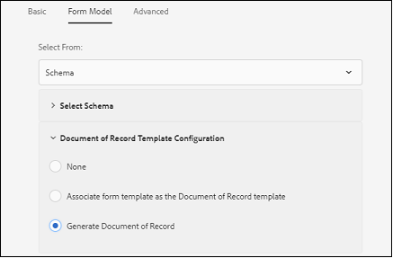

# Recommended workflows to enable Document of Record generation for adaptive forms {#recommended-workflows-dor-generation}

The Document of Record (DoR) enables you to keep a record of the information that you provide and submit in an adaptive form so that you can refer to it later.
The DoR uses a base template to define its layout. You can generate a DoR either using a default template or associating any other template with the adaptive form.

For more information on generating a DoR, see [Generate Document of Record for adaptive forms](https://helpx.adobe.com/experience-manager/6-5/forms/using/generate-document-of-record-for-non-xfa-based-adaptive-forms.html).

The [Automated Forms Conversion service (AFCS)](/help/using/introduction.md) converts the following source forms to adaptive forms:

* non-interactive PDF forms
* Acro Forms
* XFA-based PDF forms

Based on the source form that you use for conversion, you can generate a DoR using:

* a default template
* the source form as template - If you select this option, the conversion service automatically associates the source form with the converted adaptive form as the DoR template.
* associate any other template with the converted adaptive form

The following table illustrates an example of how the DoR template that you use impacts the layout of the generated DoR:

<table> 
 <tbody>
 <tr>
  <td>
<strong>Source Form</strong>
</td>
  <td>
<strong>Generated DoR</strong>
</td> 
   </tr>
  <tr>
   <td></td>
   <td>
If you use the default template to generate DoR: </td>
   </tr>
   <tr>
   <td></td>
   <td>
If you use source form as the template to generate DoR: 
</td>
   </tr>
  </tbody>
</table>

As illustrated in the table, if you use source form as the template, the DoR retains the layout of the source form.
This article describes the recommended paths to generate a DoR based on the three types of source forms.

<table> 
 <tbody> 
  <tr> 
   <th><strong>Source Form</strong></th> 
   <th><strong>Methods to generate DoR</strong></th> 
  </tr> 
  <tr> 
   <td>
Non-interactive PDF forms
</td> 
   <td> 
    <ul> 
     <li><a href="#generate-document-of-record-using-cloud-configuration">Enable DoR generation before adaptive form conversion to generate DoR using a default template</a></li> 
     <li><a href="#edit-adaptive-form-properties-generate-document-of-record">Edit adaptive form properties after adaptive form conversion to enable DoR generation using default or any other form template</a></li> 
    </ul> </td> 
  </tr>
  <tr> 
   <td>
Acro Forms or XFA-based PDF forms
</td> 
   <td> 
    <ul> 
     <li><a href="#use-input-form-as-template-to-generate-document-of-record">Enable DoR generation before adaptive form conversion to generate DoR using source form as the template</a></li> 
     <li><a href="#edit-adaptive-form-properties-to-generate-document-of-record">Edit adaptive form properties after adaptive form conversion to enable DoR generation using default template, source form as the template, or any other form template</a></li> 
    </ul> </td> 
  </tr>    
 </tbody> 
</table>

## Generate Document of Record for Non-interactive PDF forms {#generate-document-of-record-non-interactive-pdf}

If you are using a non-interactive PDF form as the source form for Automated Forms Conversion service (AFCS), you can:

* either enable DoR generation before adaptive form conversion to generate DoR using a default template
* or edit adaptive form properties after adaptive form conversion to enable DoR generation using default or any other form template

### Enable DoR generation before conversion to generate DoR using default template {#generate-document-of-record-using-cloud-configuration}

1. Select **[!UICONTROL Tools]** > **[!UICONTROL Cloud Services]** > **[!UICONTROL Automated Forms Conversion Configuration]** > Properties of cloud configuration used for conversion > **[!UICONTROL Advanced]** > **[!UICONTROL Generate Document of Record]** option.

   

1. Tap **[!UICONTROL Save & Close]** to save the settings.

1. [Run the conversion](/help/using/convert-existing-forms-to-adaptive-forms.md). Ensure that you use the cloud configuration edited in step 1 of these instructions.
On submitting the converted adaptive form, the DoR gets automatically generated using the default template.

### Edit adaptive form properties after conversion to enable DoR generation {#edit-adaptive-form-properties-generate-document-of-record}

If you do not enable DoR generation before converting the source form in to an adaptive form, you can still do so after conversion.

1. [Run the conversion](/help/using/convert-existing-forms-to-adaptive-forms.md) on the non-interactive PDF form to generate an adaptive form.

1. Select the adaptive form in the **[!UICONTROL output]** folder and tap **[!UICONTROL Properties]**.

1. In the **[!UICONTROL Form Model]** tab, expand the **[!UICONTROL Document of Record Template Configuration]** section and select **[!UICONTROL Generate Document of Record]**.

   

1. Tap **[!UICONTROL Save & Close]** to save the settings.

On submitting the converted adaptive form, the DoR gets automatically generated using the default template. If you want to associate any other DoR template with the converted adaptive form, you can select **[!UICONTROL Associate form template as the Document of Record template]** option.

## Generate Document of Record for Acro Forms or XFA-based PDF forms {#generate-document-of-record-acroform-xfaform}

If you are using an Acro Form or XFA-based PDF form as the source form for Automated Forms Conversion service (AFCS), you can:

* either enable DoR generation before adaptive form conversion to generate DoR using source form as the template

* or edit adaptive form properties after adaptive form conversion to enable DoR generation using default template, source form as the template, or any other form template

### Enable DoR generation before conversion to generate DoR using source form template {#use-input-form-as-template-to-generate-document-of-record}

1. Select **[!UICONTROL Tools]** > **[!UICONTROL Cloud Services]** > **[!UICONTROL Automated Forms Conversion Configuration]** > Properties of cloud configuration used for conversion > **[!UICONTROL Advanced]** > **[!UICONTROL Generate Document of Record]** option.

1. Tap **[!UICONTROL Save & Close]** to save the settings.

1. [Run the conversion](/help/using/convert-existing-forms-to-adaptive-forms.md). Ensure that you use the cloud configuration edited in step 1 of these instructions.
The conversion service automatically associates the Acro Form or XFA-based PDF form to the converted adaptive form as the DoR template.
You can open the adaptive form properties to view the DoR template in the **[!UICONTROL Document of Record Template Configuration]** section of **[!UICONTROL Form Model]** tab.

   

    On submitting the converted adaptive form, the DoR gets automatically generated using the source form template.

### Edit adaptive form properties after conversion to enable DoR generation {#edit-adaptive-form-properties-to-generate-document-of-record}

1. [Run the conversion](/help/using/convert-existing-forms-to-adaptive-forms.md) on the non-interactive PDF form to generate an adaptive form.

1. Select the adaptive form in the **[!UICONTROL output]** folder and tap **[!UICONTROL Properties]**.

1. In the **[!UICONTROL Form Model]** tab, expand the **[!UICONTROL Document of Record Template Configuration]** section and select **[!UICONTROL Generate Document of Record]** to enable DoR generation using the default template.
You can also select the **[!UICONTROL Associate form template as the Document of Record template]** option and select the template to enable DoR generation using source form template or any other form template.

1. Tap **[!UICONTROL Save & Close]** to save the settings.
