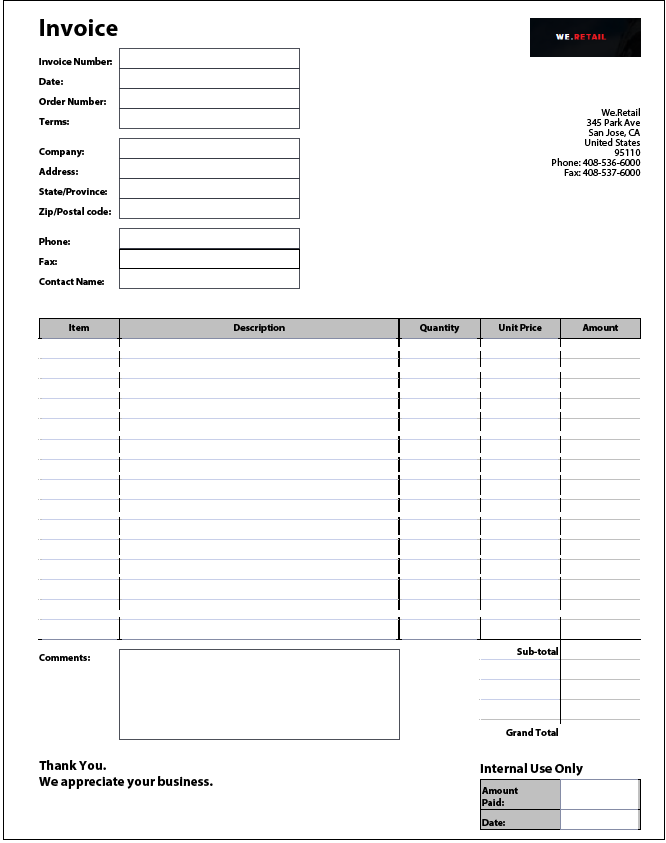
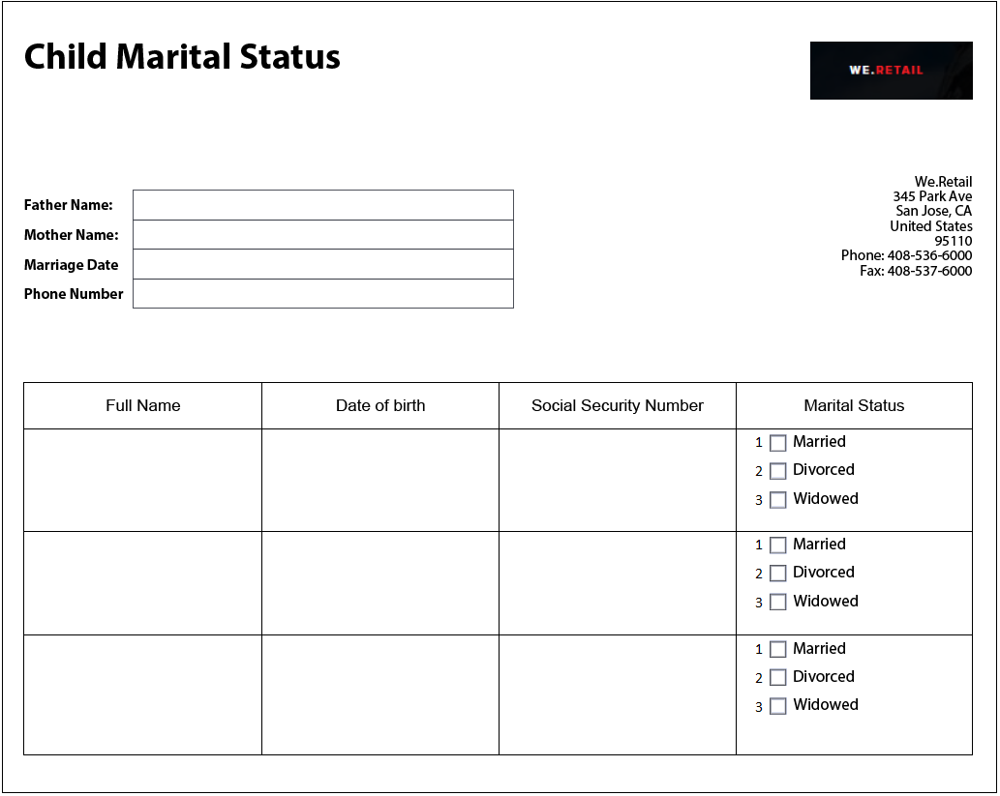

# Best practices and known complex patterns {#Best-practices-and-considerations2}

This document provides guidelines and recommendations that forms administrator, authors, and developers can benefit from when working with [!DNL Automated Forms Conversion service] (AFCS). It discusses best practices right from preparing source forms to fixing complex patterns that require some extra effort for automated conversion. These best practices collectively contribute to the overall performance and output of the [!DNL Automated Forms Conversion service] (AFCS).

## Best practices

The conversion service converts PDF forms available on your AEM [!DNL Forms] instance to adaptive forms. The best practices listed below help you improve the conversion speed and accuracy. Moreover, these best practices help you save time spent on after conversion activities.

### Before you upload source 

You can upload all the PDF forms at once or in a phased manner, as required. Before uploading the forms, consider the following:

* Keep the number of forms in a folder less than 15 and keep the total number of pages in a folder less than 50.
* Keep the size of the folder less than 10 MB. Do not keep forms in a sub-folder.
* Keep the number of pages in a form less than 15.
* Organize source documents into a batch of 8-15 documents. Keep source forms with common Adaptive Form Fragments in a single batch.
* Do not upload the protected forms. The service does not convert password-protected and secured forms.
* Do not upload the [PDF Portfolios](https://helpx.adobe.com/acrobat/using/overview-pdf-portfolios.html). The service does not convert a PDF Portfolio to an adaptive form.
* Do not upload source forms with spaces in the filename. Remove the space from the name of the file before uploading the forms.
* Do not upload scanned, filled, and forms in any language other than English, French, German, Spanish, Italian, and Portuguese. Such forms are not supported.

When you use an XDP form for conversion, perform the following steps before uploading the source XPD forms: 

* Analyze the XDP form and fix visual issues. Ensure that the source document uses intended controls and structures. For example, the source form may have checkboxes instead of radio buttons for a single selection. Change checkboxes to radio buttons to produce an adaptive form with intended components.  
* [Add bindings to the XDP form](http://www.adobe.com/go/learn_aemforms_designer_65) before starting the conversion. When bindings are available in the source XDP form, the service automatically applies bindings to corresponding adaptive form fields during conversion. It saves you the time required to manually apply the bindings.  
* [Add Adobe Sign tags](https://helpx.adobe.com/sign/using/text-tag.html) to the XDP file. The service automatically converts Adobe Sign tags to corresponding adaptive form fields. Adaptive Forms support a limited number of Adobe Sign fields. For the complete list of supported fields, see [Using Adobe Sign in an adaptive form](https://experienceleague.adobe.com/docs/experience-manager-65/forms/adaptive-forms-advanced-authoring/working-with-adobe-sign.html?lang=en) documentation.  
* Convert complex tables in XDP documents to simple tables, if possible. A table with form fields in table cells, uneven sized cells, row or column spanned cells, merged cells, partial borders, or no visible border is considered a complex table. A table with any one of the above mentioned items is considered a complex table.
<!-- * Use sub-forms in XDP documents to create panels in adaptive forms. Service converts each sub-form to one or more adaptive form panels during conversion. -->

### Before you start the conversion

* Create adaptive form templates. Templates help specify a uniform structure to forms of your organization or department.
* Specify the header and footer in the adaptive form templates. The service ignores the header-footer of source documents and uses header-footer specified in the adaptive form template.
* Create adaptive form themes. Themes help provide a uniform look and feel to forms of your organization or department.
* Configure Form Data Model to save and retrieve from a data source. Create and configure read and write services for the Form Data Model.
* Create Adaptive Form Fragments and configure the service to use your Adaptive Form Fragments.
* Prepare common workflow models for the forms that require business process automation.  
* Configure Adobe Analytics, if required

## Know complex patterns

AEM [!DNL Forms Automated Conversion service] uses artificial intelligence and machine learning algorithms to understand the layout and fields of the source form. Every machine learning service continuously learns from source data and produces an improved output with every churn. These services learn from experience like humans.

[!DNL Automated Forms Conversion service](AFCS) is trained on a large set of forms. It easily identifies fields in a source form and produces adaptive forms. However, there are some fields and styles in PDF forms which are easily visible to the human eye but difficult to understand for the service. The service can assign different from applicable field types or panels to some fields or styles. All such field and style patterns are listed below.

The service would start identifying and assigning correct fields or panels to these patterns as it keeps learning from the source data. For the time being, you can use [Review and Correct](review-correct-ui-edited.md) editor to fix such issues. Before start fixing the issues or reading further, familiarize yourself with [adaptive form components](https://helpx.adobe.com/experience-manager/6-5/forms/using/introduction-forms-authoring.html).

### General patterns {#general}

|Pattern|Example|
|--- |--- |
|**Pattern**  Service does not convert filled PDF forms to an adaptive form.   **Resolution**  Use empty adaptive forms.|  |
|**Pattern**  Service can fail to recognize text and fields in a dense form.   **Resolution**   Increase the width between text and fields of a dense form before starting the conversion.||
|**Pattern**  Service does not support scanned forms.   **Resolution**  Do not use scanned forms.|| 
|**Pattern**  Service does not extract images and text within images.   **Resolution**   Manually add images or text to converted forms.||
|**Pattern**  Tables with dotted or non-clear boundaries and borders do not convert.   **Resolution**  Use tables with clear explicit boundaries and borders. supported.| |
|**Pattern**   Adaptive forms do not support vertical text out of the box. So, the service does not convert vertical text to corresponding Adaptive Forms text.   **Resolution**   Use adaptive form editor to add vertical text, if required. | |

### Choice group  {#choice-group}

|Pattern|Resolution|
|--- |--- |
|**Pattern**   Choice group options with shapes other than box or circle are not converted to corresponding adaptive form components.   **Resolution**   Change choice options shapes to box or circle or use Review and Correct editor to identify the shapes.| |

### Form fields {#form-fields}

|Pattern|Resolution|
|--- |--- |
|**Pattern**   Service does not identify fields without clear borders.   **Resolution**   Use Review and Correct editor to identify such fields.| |
|**Pattern**   Service may not identify some choice group form fields with captions at the bottom or right side of a form.   **Resolution**   Use Review and Correct editor to identify such fields| |
|**Pattern**   Service merges or assigns a wrong type to some form fields that are placed very near to each other or do not have clear borders.   **Resolution**   Use Review and Correct editor to identify such fields.| |
|**Pattern**   Service can fail to recognize fields with far away captions or a dotted line between the caption and input field.   **Resolution**   Use forms fields with clear boundaries or use Review and Correct editor to fix such issues.| |

### Lists {#lists}

|Pattern|Resolution|
|--- |--- |
|**Pattern**  Lists containing form fields are merged or not converted to corresponding adaptive form components   **Resolution**  Use forms fields with clear boundaries or use Review and Correct editor to fix such issues.||
|**Pattern**  Service can leave a few nested lists unidentified   **Resolution**   Use Review and Correct editor to fix such issues.||
|**Pattern**   Service merges some lists containing choice groups with each other   **Resolution**   Use Review and Correct editor to fix such issues.|  |

<!--
Comment Type: draft

<h3>Choice groups</h3>
-->

<!--
Comment Type: draft

<ul>
<li>Lists with form fields, nested lists, and nested choice groups are not supported.</li>
<li>Form fields with captions at bottom or right are not supported.</li>
<li>Form fields without borders are not supported.</li>
<li>Hidden form fields are not supported.</li>
<li>Button in PDF forms are not converted to adaptive form buttons.  </li>
<li>Tables with clear explicit boundaries and borders are supported.</li>
<li>Fields with far away captions are not supported.  </li>
<li>Choice groups with only box or circle shaped selectors are supported. </li>
</ul>
-->
