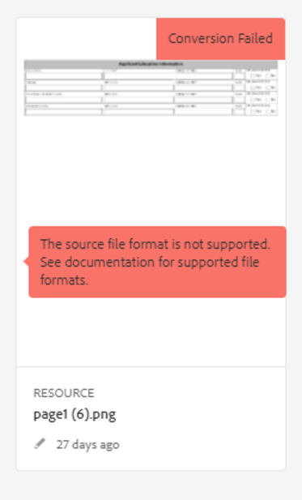
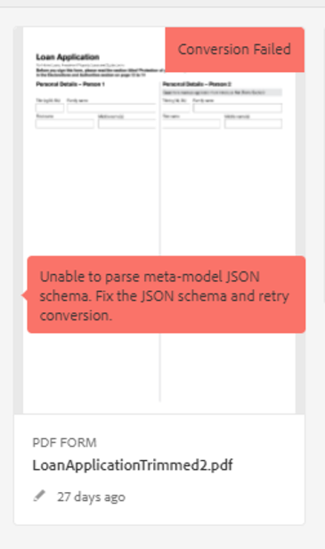

# Troubleshoot Automated Forms Conversion Service (AFCS)

The document provides basic troubleshooting steps for common errors.

<!--The article provides information on installation, configuration and administration issues that may arise in an Automated Forms Conversion Service production environment. --> 

## Common errors {#commonerrors}

|Error|Example|
|--- |--- |
|**Error Message**   The access token header is not available.    **Reason**   An administrator has created multiple IMS configurations or IMS configuration is not able to reach AFCS service on Adobe Cloud.   **Resolution**   If there are multiple configurations, delete all the configurations and [create a new configuration](configure-service.md#obtainpubliccertificates).   If there is a single configuration, use **Health Check** to [check connectivity](configure-service.md#createintegrationoption).|  |
|**Error Message**   Unable to connect to the service.    **Reason**   Incorrect service URL or no service URL is mentioned in Automated Forms Conversion Service (AFCS) cloud services.   **Resolution**   Correct [Service URL](configure-service.md#configure-the-cloud-service) in Automated Forms Conversion Service (AFCS) Cloud services.||
|**Error Message**   The service failed to convert the form.    **Reason**   Network connectivity issues at your end, the service is down due to scheduled maintenance, or outage on Adobe Cloud.   **Resolution**   Resolve network connectivity issues at your end and check the status of the service on https://status.adobe.com/ for a planned or unplanned outage.||
|**Error Message**   The number of pages is more than 15.    **Reason**   The source form is more than 15 pages long.    **Resolution**   Use Adobe Acrobat to split forms with more than 15 pages. Bring the number of pages in a form to less than 15. ||
|**Error Message**   The number of files is more than 15.    **Reason**    The folder contains more than 15 forms.   **Resolution**   Bring the number of forms in a folder to less than or equal to 15. Bring the total number of pages in a folder less than 50. Bring the size of the folder to less than 10 MB. Do not keep forms in a sub-folder. Organize source forms into a batch of 8-15 forms. ||
|**Error Message**   The source file format is not supported.    **Reason**   The folder containing source forms have some unsupported files.   **Resolution**   The service supports only .xdp and .pdf files. Remove files with any other extension from the folder and run the conversion. ||
|**Error Message**   Scanned forms are not supported.    **Reason**   The PDF form contains only scanned images of the form and contains no content structure.   **Resolution**   The service does not support converting scanned forms or an image of a form to an adaptive out-of-the-box. However, you use Adobe Acrobat to convert the image of a form to a PDF Form. Then, use the service to convert the PDF Form to an adaptive form. Always use a high-quality image of the form for conversion in Acrobat. It improves the quality of the conversion. ||
|**Error Message**   Encrypted PDF form is not supported.    **Reason**   The folder contains encrypted PDF forms.   **Resolution**   The service does not support converting an encrypted PDF form to an adaptive form. Remove the encryption, upload the non-encrypted form, and run the conversion. ||
|**Error Message**   Unable to parse meta-model JSON schema.    **Reason**   The JSON schema supplied to the service is not properly formatted, contains invalid characters, or uses invalid syntax to map components.    **Resolution**   Check the formatting of the JSON file. You can use any online JSON validator to check the formatting and structure of the schema. See, [Extend the default meta-model](extending-the-default-meta-model.md) article for information on meta-model syntax. ||
|**Error (On-premise environments only)**   The **[!UICONTROL Source Language]** option does not list the correct language of an Adaptive Form.   **Reason**   The jcr:language property of the adaptive form is not set correctly.    **Resolution**   Open CRX-DE lite, navigate to `/content/forms/af/`, open the `jcr:content` node, and set value of the node to the correct language. For the list of supported languages, see [Add localization support for non-supported locales](https://experienceleague.adobe.com/docs/experience-manager-65/forms/manage-administer-aem-forms/supporting-new-language-localization.html#add-localization-support-for-non-supported-locales). ||

<!--

<table>
<thead>
<tr>
<th>Error</th>
<th>Example</th>
</tr>
</thead>
<tbody>
<tr>
<td><strong>Error Message</strong> 
 The access token header is not available. 
 <strong>Reason</strong>   An administrator has created multiple IMS configurations or IMS configuration is not able to reach AFCS service on Adobe Cloud.   <strong>Resolution</strong>   If there are multiple configurations, delete all the configurations and <a href="configure-service.md#obtainpubliccertificates">create a new configuration</a>.   If there is a single configuration, use <strong> Health Check </strong> to <a href="configure-service.md#createintegrationoption">check connectivity</a>.</td>
<td></td>
</tr>
<tr>
<td><strong>Error Message</strong>   Unable to connect to the service.    <strong>Reason</strong>   Incorrect service URL or no service URL is mentioned in Automated Forms Conversion Service (AFCS) cloud services.   <strong>Resolution</strong>   Correct <a href="configure-service.md#configure-the-cloud-service">Service URL</a> in Automated Forms Conversion Service (AFCS) Cloud services.</td>
<td></td>
</tr>
<tr>
<td><strong>Error Message</strong>   The service failed to convert the form.    <strong>Reason</strong>   Network connectivity issues at your end, the service is down due to scheduled maintenance, or outage on Adobe Cloud.   <strong>Resolution</strong>   Resolve network connectivity issues at your end and check the status of the service on <a href="https://status.adobe.com/">https://status.adobe.com/</a> for a planned or unplanned outage.</td>
<td></td>
</tr>
<tr>
<td><strong>Error Message</strong>   The number of pages is more than 15.    <strong>Reason</strong>   The source form is more than 15 pages long.    <strong>Resolution</strong>   Use Adobe Acrobat to split forms with more than 15 pages. Bring the number of pages in a form to less than 15.</td>
<td></td>
</tr>
<tr>
<td><strong>Error Message</strong>   The number of files is more than 15.    <strong>Reason</strong>    The folder contains more than 15 forms.   <strong>Resolution</strong>   Bring the number of forms in a folder to less than or equal to 15. Bring the total number of pages in a folder less than 50. Bring the size of the folder to less than 10 MB. Do not keep forms in a sub-folder. Organize source forms into a batch of 8-15 forms.</td>
<td></td>
</tr>
<tr>
<td><strong>Error Message</strong>   The source file format is not supported.    <strong>Reason</strong>   The folder containing source forms have some unsupported files.   <strong>Resolution</strong>   The service supports only .xdp and .pdf files. Remove files with any other extension from the folder and run the conversion.</td>
<td></td>
</tr>
<tr>
<td><strong>Error Message</strong>   Scanned forms are not supported.    <strong>Reason</strong>   The PDF form contains only scanned images of the form and contains no content structure.   <strong>Resolution</strong>   The service does not support converting scanned forms or an image of a form to an adaptive out-of-the-box. However, you use Adobe Acrobat to convert the image of a form to a PDF Form. Then, use the service to convert the PDF Form to an adaptive form. Always use a high-quality image of the form for conversion in Acrobat. It improves the quality of the conversion.</td>
<td></td>
</tr>
<tr>
<td><strong>Error Message</strong>   Encrypted PDF form is not supported.    <strong>Reason</strong>   The folder contains encrypted PDF forms.   <strong>Resolution</strong>   The service does not support converting an encrypted PDF form to an adaptive form. Remove the encryption, upload the non-encrypted form, and run the conversion.</td>
<td></td>
</tr>
<tr>
<td><strong>Error Message</strong>   Unable to parse meta-model JSON schema.    <strong>Reason</strong>   The JSON schema supplied to the service is not properly formatted, contains invalid characters, or uses invalid syntax to map components.    <strong>Resolution</strong>   Check the formatting of the JSON file. You can use any online JSON validator to check the formatting and structure of the schema. See, <a href="extending-the-default-meta-model.md">Extend the default meta-model</a> article for information on meta-model syntax.</td>
<td></td>
</tr>
</tbody>
</table>
-->
